## 1. Создание виртуальной машины

_параметры VM_

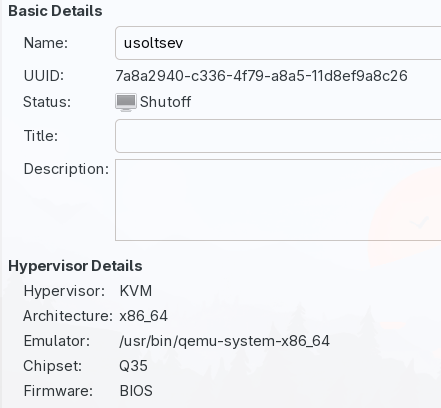

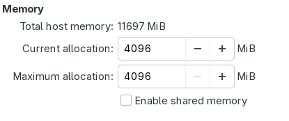

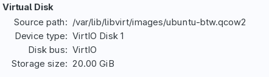

_командная строка после запуска_

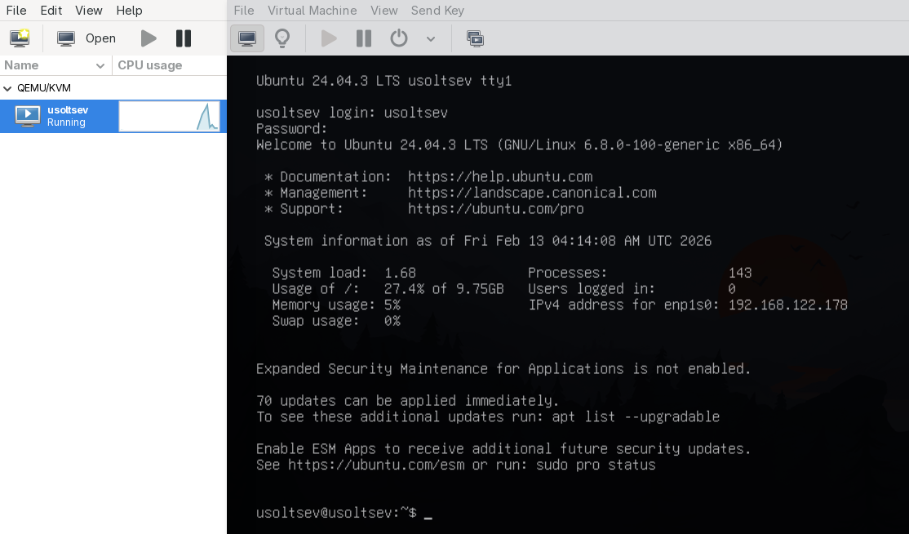

## 2. Информация о системе

_вывод `cat ~/report/01-system.txt`_

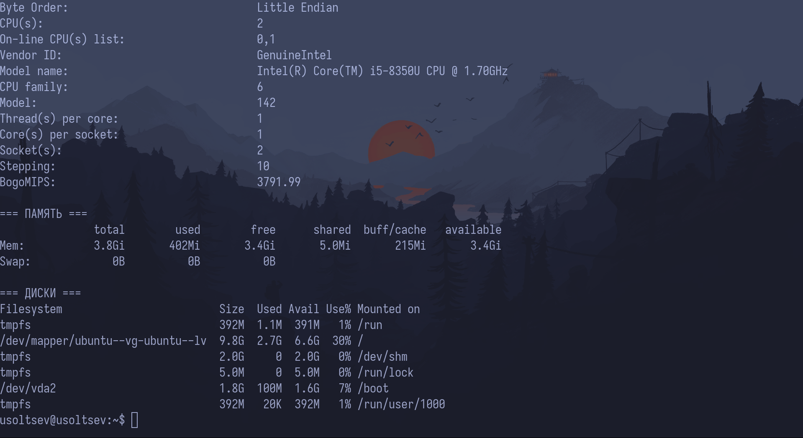

## 3. Сеть: IP-адрес и открытые порты

_вывод `ip addr show`_

_вывод `sudo ss -tlnp`_

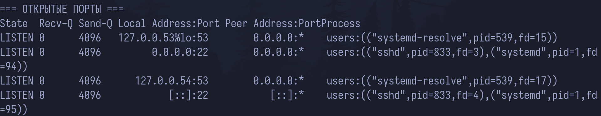

## 4. Сервис SSH

_вывод `sudo systemctl status ssh`_

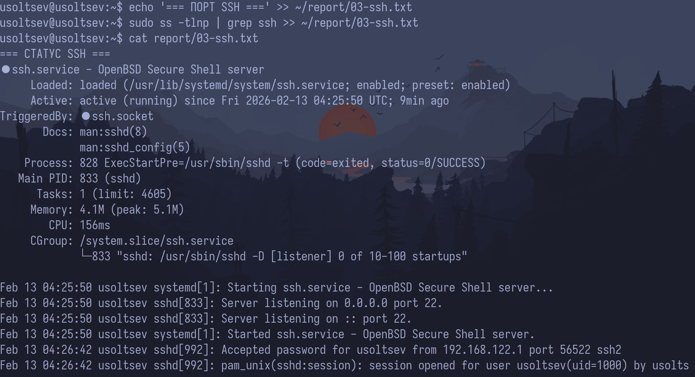

_вывод `sudo ss -tlnp | grep ssh`_

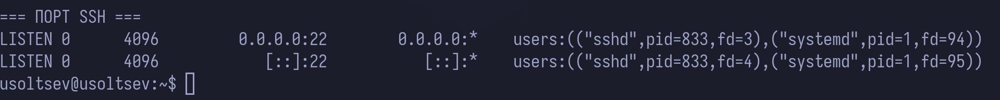

## 5. Пользователи и группы

_вывод `grep '/bin/bash' /etc/passwd`_

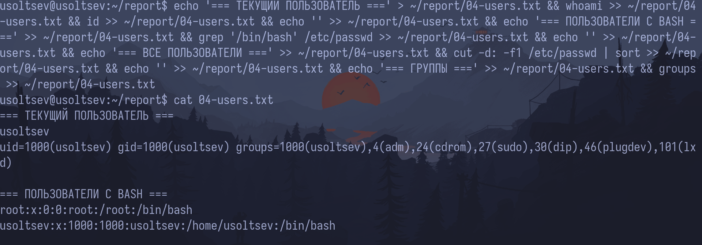

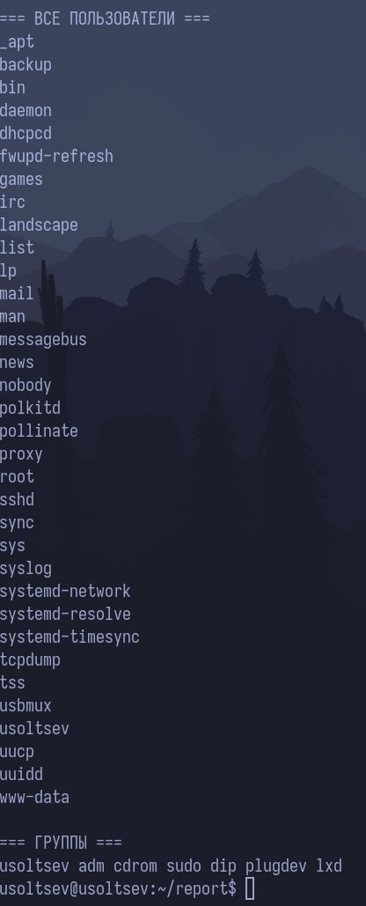

_процесс создания пользователя `boardy`_

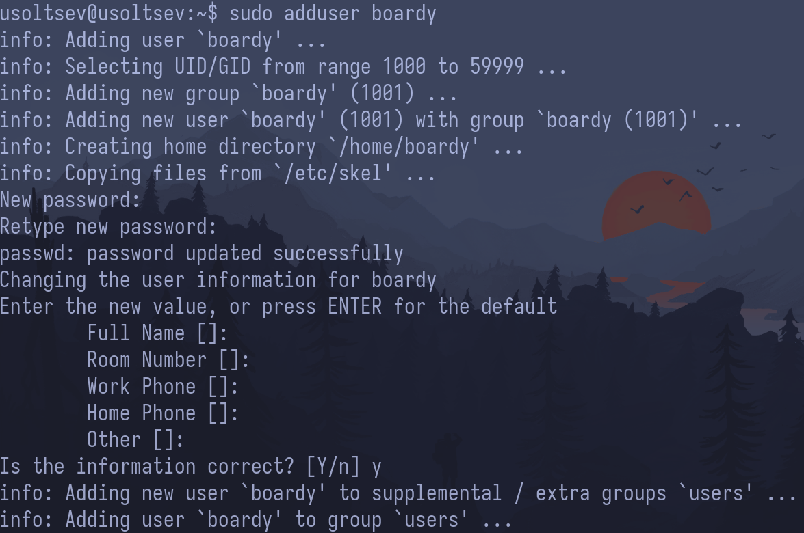

_вывод `id boardy`_

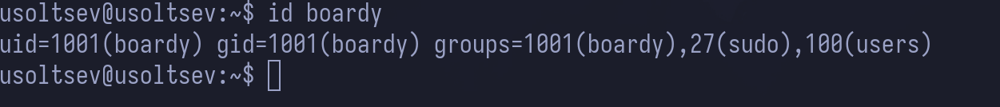

## 6. Дерево каталогов

_вывод `ls -la /`_

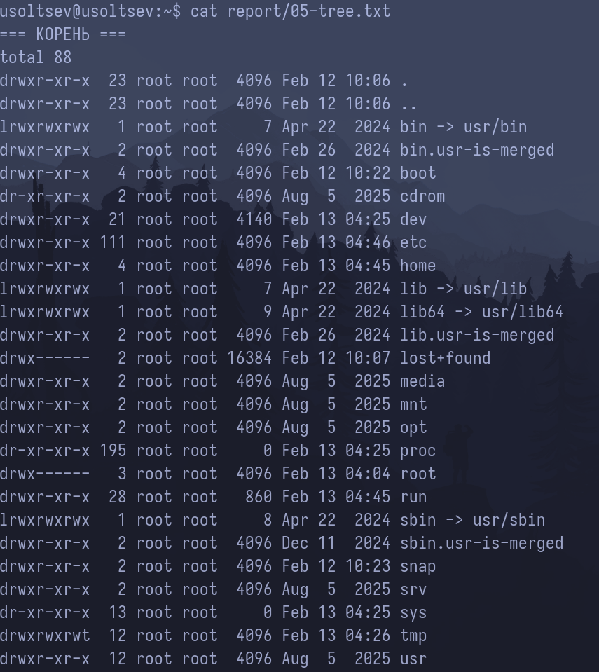

_вывод `ls -la ~`_

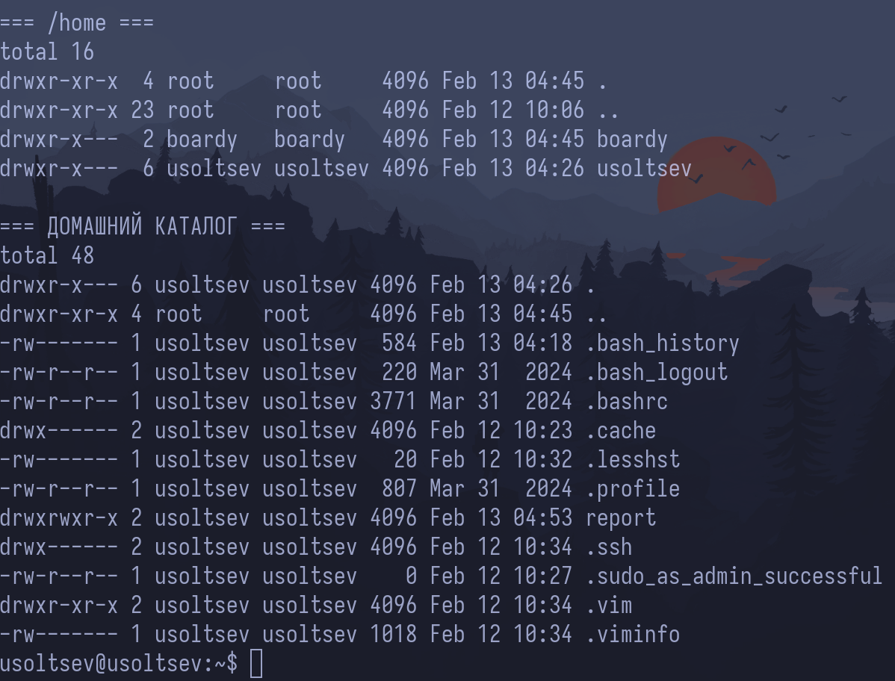

## 7. Права доступа

_вывод `ls -ld / /etc /var /tmp /home`_

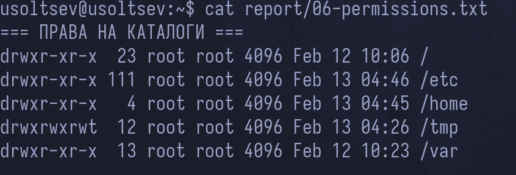

_три состояния `testfile.txt` (до, после chmod 755, после chmod 600)_

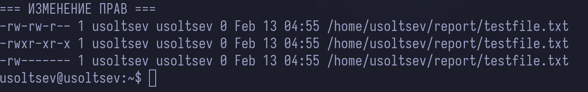

## 8. Установленные пакеты и сервисы

_вывод `dpkg -l | grep -E 'openssh|python3.12|git|curl|vim|nano'`_

**я добавил в команду версию для python, потому что иначе выводит слишком много пакетов**

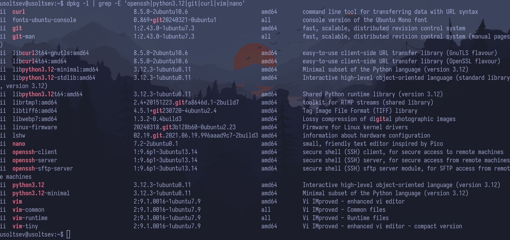

_вывод `systemctl list-units --type=service --state=running`_

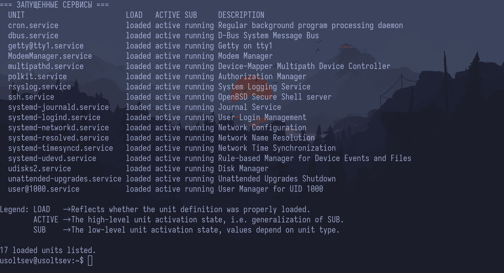

## 9. Конвейер и перенаправление

_вывод `ps aux --sort=-%mem | head -11`_

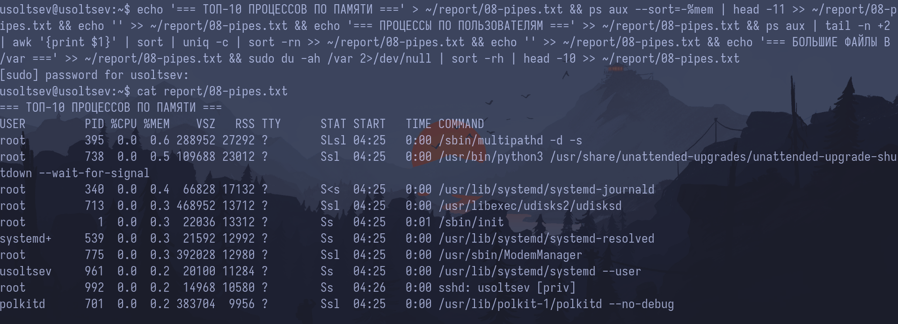

_вывод подсчёта процессов по пользователям_

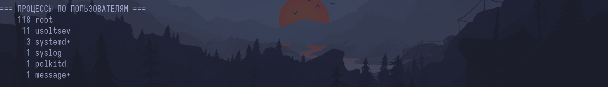

_вывод топ-10 больших файлов в /var_

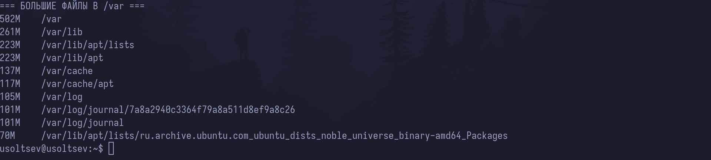

## 10. Итоговый файл

_вывод `ls -lh ~/report/`_

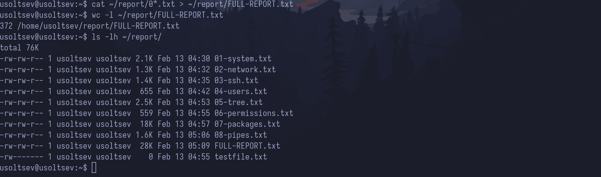
