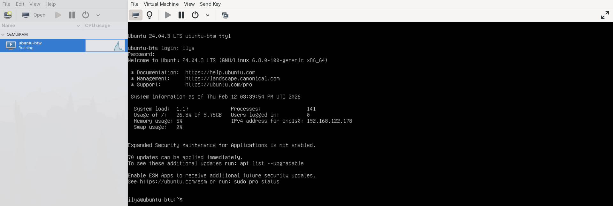
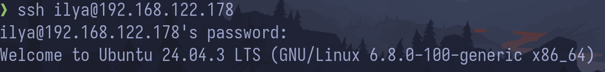

## 1. Создание VM

Для создания виртуальной машины я выбрал Virt-Manager, который является gui на основе KVM/QEMU.
Я предпочел его VMWare и VirtualBox, потому что он open source и должен превосходить по производительности конкурентов, так как использует "Bare-Metal" гипервизор.
В качестве VM использовал последнюю версию Ubuntu Live Server.

_Virt-Manager с запущенным Ubuntu_

## 2. Подключение через ssh

Предлагалось использовать для этой цели Putty, но на данный момент я не вижу смысла в его установке, потому что я могу подключиться через свой терминал, используя openssh.

_Команда для подключения_

_Сообщение для всех пользователей_
