# Часть A. Подготовка и вёрстка

## 1. Столбец password_hash

Добавлен столбец в таблицу users.

```sql
ALTER TABLE users ADD COLUMN password_hash VARCHAR(255) DEFAULT NULL;
```

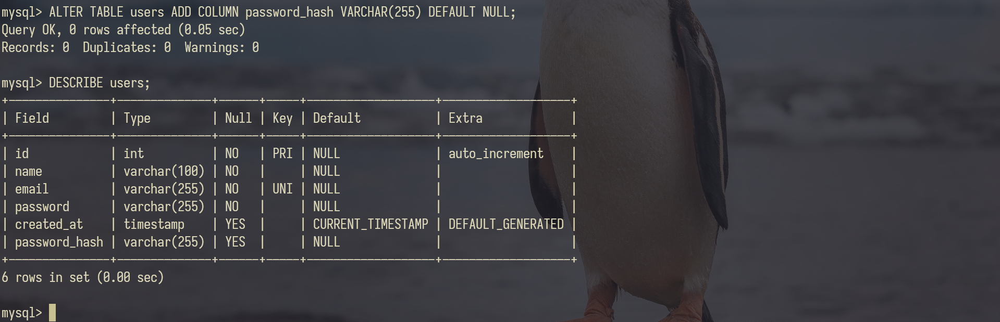

- Почему VARCHAR(255), а не VARCHAR(60)?

Хеш bcrypt занимает 60 символов, но стадарты могу поменяться, поэтому с запасом.

- Что бы произошло, если сделать VARCHAR(50)?

БД выдала бы ошибку усечения данных (Data Truncation Error) или молча обрезала бы хеш, сделав невозможным последующую проверку пароля.

## 2. Partials

Создан файл partials/nav.php по макету 1 (гостевое меню) и макету 2 (меню залогиненного). Меню реализовано в одном файле и показывает разные ссылки в зависимости от состояния $\_SESSION.

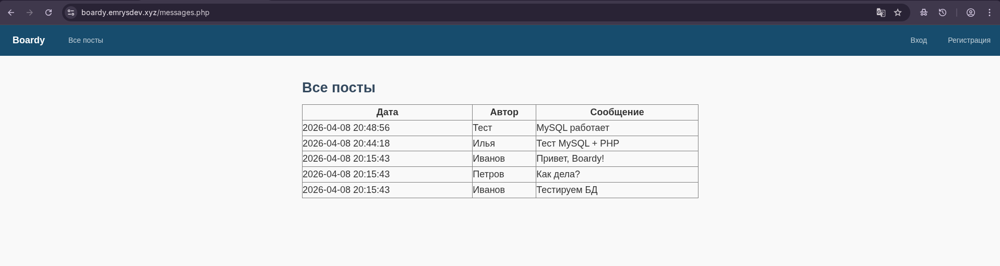

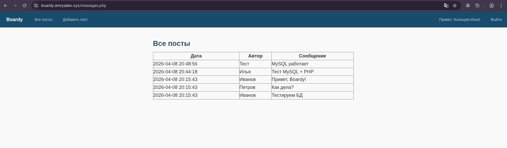

- Почему меню вынесено в отдельный файл?

Меню вынесено в отдельный файл, чтобы избежать дублирования кода и упростить поддержку за счёт подключения одного фрагмента на всех страницах.

- Что изменится, если добавить новую ссылку — например, «Избранное»?

При добавлении новой ссылки, например «Избранное», достаточно изменить только файл nav.php, и она автоматически появится на всех страницах сайта.

## 3. Вёрстка форм по макетам

Сверстаны файлы register.php (макет 3) и login.php (макет 4). На данном этапе реализованы только HTML и стили, без обработки формы.

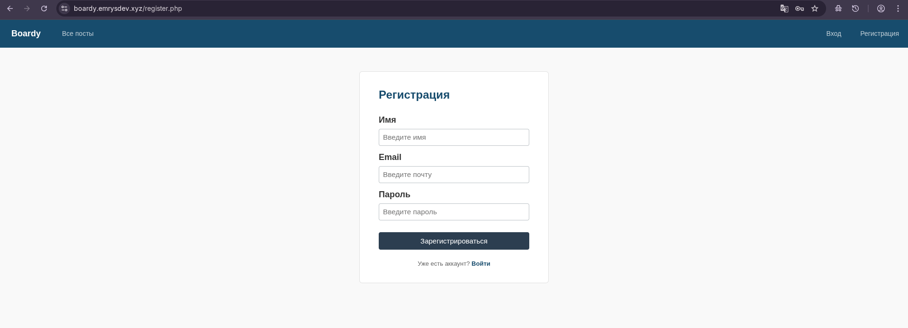

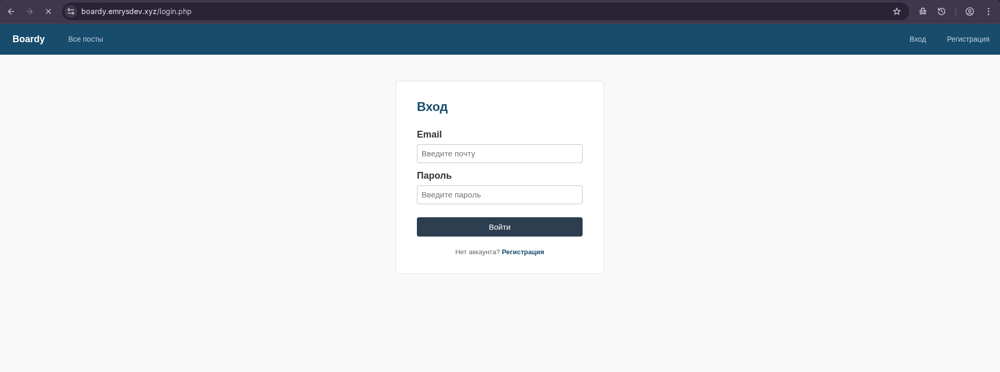

# Часть B. Регистрация и логин

## 4. Регистрация

Добавлен обработчик формы в register.php. После успешной регистрации настроен автологин пользователя и перенаправление на messages.php.


## 5. Хеш в базе

Выполнен запрос для проверки сохраненных данных:

```sql
SELECT id, name, email, password_hash FROM users;
```

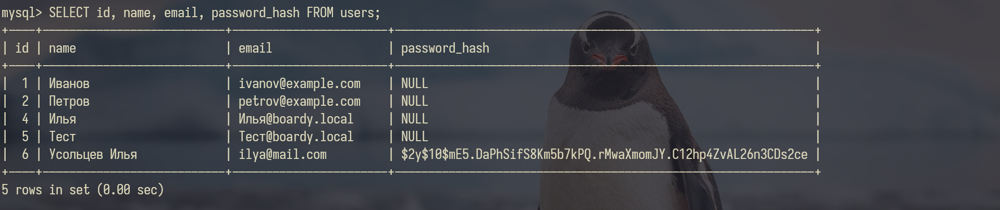

- Объясните структуру хеша $2y$10$Kx8QnZq... — что означает каждая часть?

Хеш состоит из префикса алгоритма ($2y$ — bcrypt), стоимости (cost factor) 10, 22-символьной соли и самого хеша.

- Что произойдёт, если cost factor увеличить с 10 до 15?

Если увеличить cost factor до 15, генерация хеша и проверка пароля станут примерно в 32 раза медленнее, так как вычислительная сложность удваивается с каждым шагом.

## 6. Защита от повторной регистрации

Выполнена попытка зарегистрировать второго пользователя с тем же email.

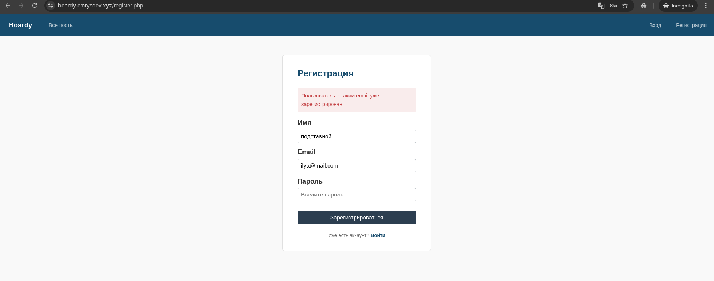

- Зачем проверять email перед INSERT?

Проверка нужна для предотвращения регистрации дубликатов.

- Что произойдёт без этой проверки?

Без неё база данных либо выдаст фатальную ошибку (из-за ограничения UNIQUE), либо создаст второго пользователя с таким же email, что сломает логику авторизации.

## 7. Логин

Написан обработчик login.php. Выполнен вход под созданным пользователем, меню успешно обновилось.

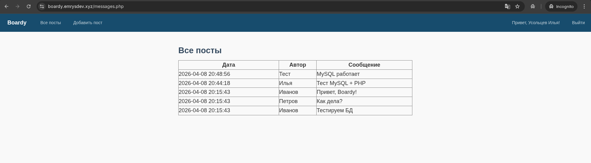

## 8. Неверный пароль

Выполнена попытка логина с неправильным паролем. Получено соответствующее сообщение об ошибке.

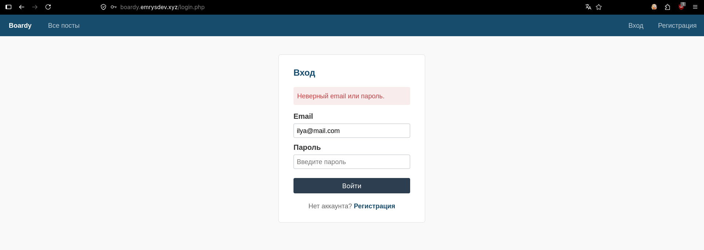

- Почему сообщение одинаковое и для "email не найден", и для "неверный пароль"?

Единое сообщение об ошибке скрывает от злоумышленника, существует ли введённый email в системе, предотвращая перебор пользователей.

# Часть C. Куки и сессии

## 9. Кука PHPSESSID

После логина открыта панель DevTools → Application → Cookies для проверки сохраненной сессии.

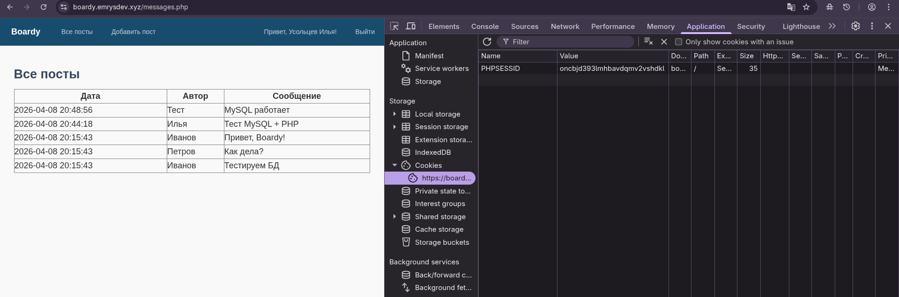

- Что хранится в значении куки? Это пароль, имя пользователя, что-то ещё? Откуда берётся значение?

В куке хранится только уникальный идентификатор сессии (PHPSESSID), генерируемый сервером случайным образом; пароли и имена там не хранятся.

## 10. Параметры куки

Проверена корректность настройки session_set_cookie_params. Установлены флаги HttpOnly, Secure и SameSite=Lax.

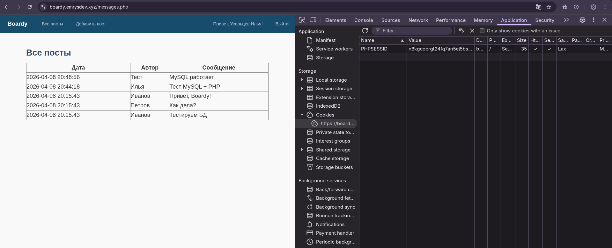

- Что изменится, если убрать HttpOnly?

Без HttpOnly кука PHPSESSID становится доступной для чтения через JavaScript.

- Как это можно использовать в XSS-атаке?

При XSS-атаке злоумышленник сможет украсть эту куку и угнать сессию пользователя.

## 11. HttpOnly на практике

В DevTools → Console введена команда для проверки доступности кук через JavaScript:

```javascript
document.cookie;
```

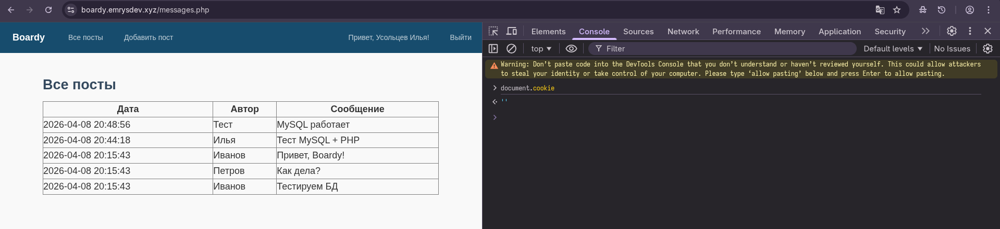

- Почему PHPSESSID не видна JavaScript, хотя кука существует?

Кука PHPSESSID не видна JavaScript из-за установленного флага HttpOnly, который на уровне браузера блокирует доступ к ней из клиентских скриптов для защиты от XSS-атак.

## 12. Файл сессии на сервере

Выполнено подключение к серверу по SSH. Найден и просмотрен файл сессии с помощью команд:

```bash
ls -la /var/lib/php/sessions/
cat /var/lib/php/sessions/sess_<ID>
```

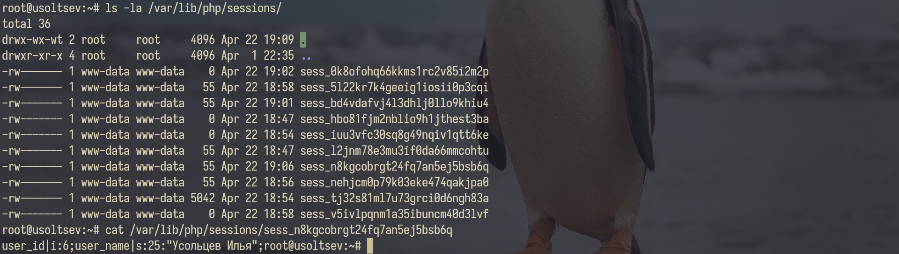

- Что хранится в файле на сервере? Сравните с тем, что в куке.

В файле на сервере хранится сериализованный массив $\_SESSION (например, user_id, user_name) в виде текстовой строки.
В куке хранится только идентификатор PHPSESSID (номер ячейки), а в файле — все данные сессии (содержимое ячейки).

- Почему данные разделены так — одно на клиенте, другое на сервере?

Данные разделены, чтобы пользователь не мог подделать важную информацию (например, права администратора) и чтобы не пересылать большие объёмы данных при каждом запросе.

# Часть D. Защита и доработка

## 13. Защита страниц

Добавлена проверка авторизации в submit.php. Настроен редирект на /login.php для неавторизованных пользователей. Проверка выполнена через консоль:

```bash
curl -v https://boardy.emrysdev.xyz/submit.php
```

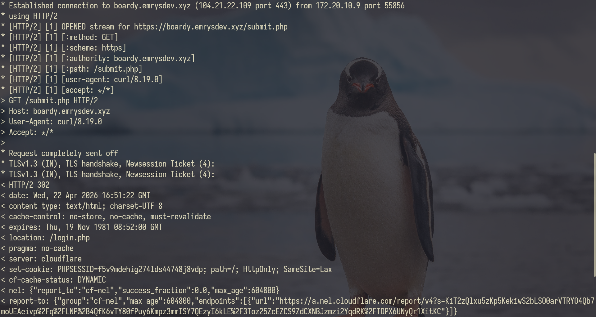

## 14. Посты с автором

Изменен файл messages.php: добавлен SQL-запрос с JOIN таблицы users для вывода имени автора каждого поста. Протестировано создание постов от разных залогиненных пользователей.

```SQL
SELECT posts.body, users.name, posts.created_at
FROM posts
JOIN users ON posts.author_id = users.id
ORDER BY posts.created_at DESC;
```

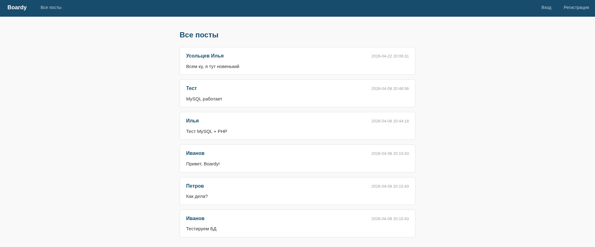

- Почему используется JOIN, а не два отдельных запроса?

Использование JOIN заменяет множество отдельных запросов (по одному на каждого автора) одним эффективным запросом, что решает проблему N+1 и снижает нагрузку на сеть.

## 15. Добавление поста

Сверстан файл submit.php по макету 5. Создан новый пост, который корректно отобразился в общей ленте с именем автора.

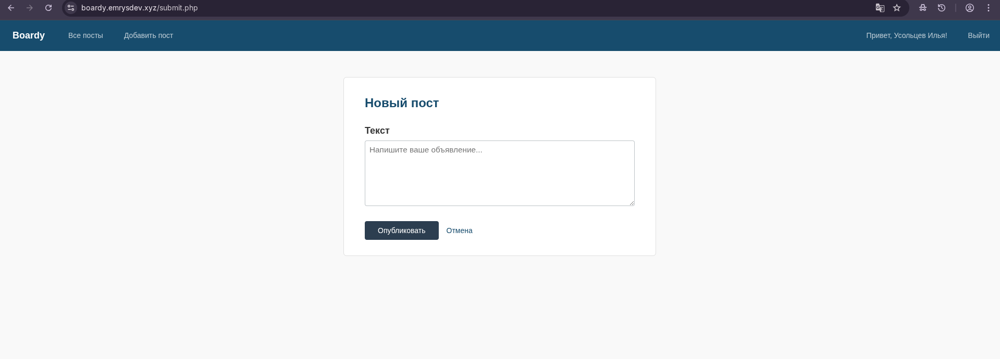

## 16. Logout

Создан файл logout.php. Выполнен выход из системы, после чего меню вернулось в гостевое состояние, а кука PHPSESSID была удалена.

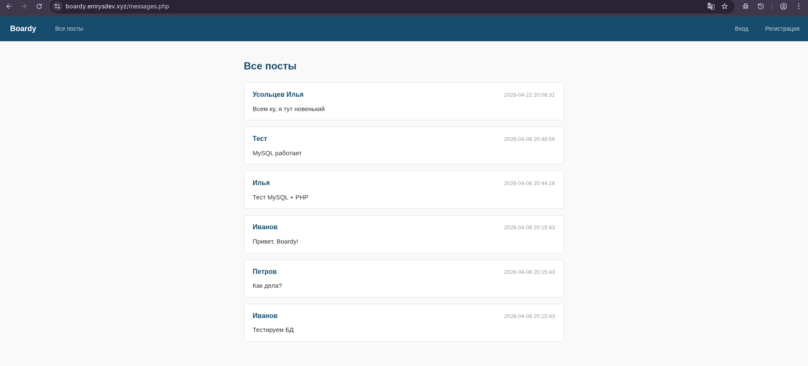
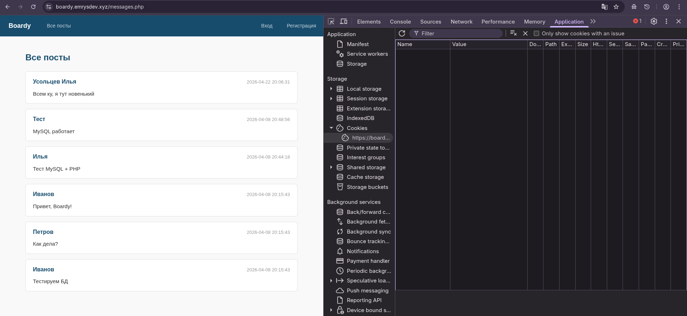

- Что делает session_destroy()?

Удаляет файл сессии на сервере и очищает массив $\_SESSION.

- Зачем ещё и setcookie() с прошедшей датой?

setcookie() с прошедшей датой заставляет браузер клиента удалить куку PHPSESSID.

- Что останется, если сделать только одно из двух?

Если сделать только session_destroy(), кука останется в браузере и при следующем запросе PHP создаст под неё новый пустой файл.
Если сделать только setcookie(), браузер забудет номер сессии, но на сервере останется файл с данными авторизации, что создаёт риск безопасности и захламляет диск.

## 17. Истёкшая сессия

Смоделирована ситуация истекшей сессии: выполнен логин, затем файл /var/lib/php/sessions/sess\_<ID> удален руками на сервере через SSH. При обновлении страницы в браузере произошел корректный редирект на login.php с submit.php

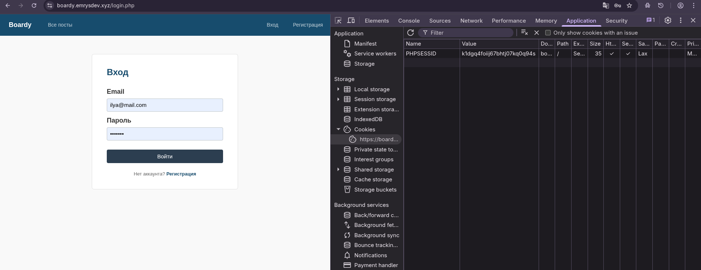

- Почему браузер считает себя залогиненным (есть кука), а сервер — нет?

Браузер считает себя залогиненным, потому что у него есть кука PHPSESSID, а сервер — нет, потому что соответствующий файл сессии был удалён, и внутри него больше нет данных о пользователе.
