# Часть A. JWT для API

## 1. Настройка auth.py

Добавлена функция `get_current_user` для проверки токена.

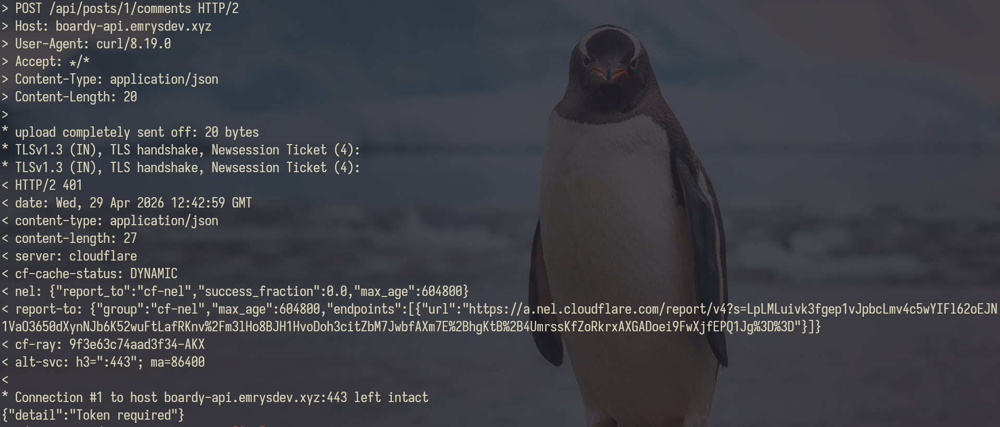

- Что означает «Bearer» в заголовке Authorization?

Слово «Bearer» (носитель) указывает на схему аутентификации. Оно сообщает серверу, что строка далее — это именно bearer-токен (согласно RFC 6750). Сервер понимает: "кто предъявил этот токен (носитель), тот и получает доступ", без дополнительных проверок (например, криптографических подписей самого запроса).

- Почему не просто «Authorization: eyJ...»?

Заголовок Authorization универсален и поддерживает разные схемы (Basic, Digest, OAuth и т.д.). Указание схемы Bearer помогает серверу правильно распарсить заголовок и применить нужный механизм валидации.

## 2. Создание эндпоинта /api/me.php

Создан скрипт для выдачи JWT авторизованным пользователям.

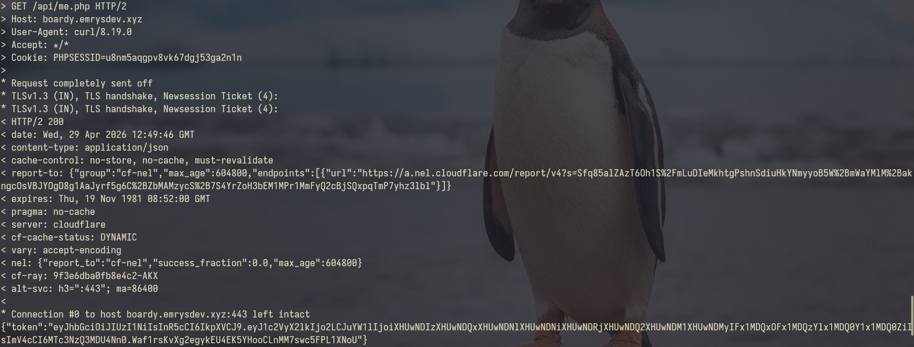

- Почему me.php использует session_start(), а не принимает логин/пароль?

me.php выступает в роли "моста" между stateful (сессии) и stateless (JWT) архитектурами. Пользователь уже авторизовался на сайте ранее. Использование session_start() позволяет взять уже существующую доверенную сессию и обменять её на токен, избавляя пользователя от необходимости вводить пароль заново.

- Какую роль играет кука PHPSESSID в этом запросе?

Кука является "пропуском" к файлу сессии на сервере. С её помощью PHP понимает, какой именно пользователь делает запрос, извлекает его user_id и name из памяти и зашивает их в новый JWT.

## 3. Получение JWT в React

Настроен useEffect для запроса к me.php.

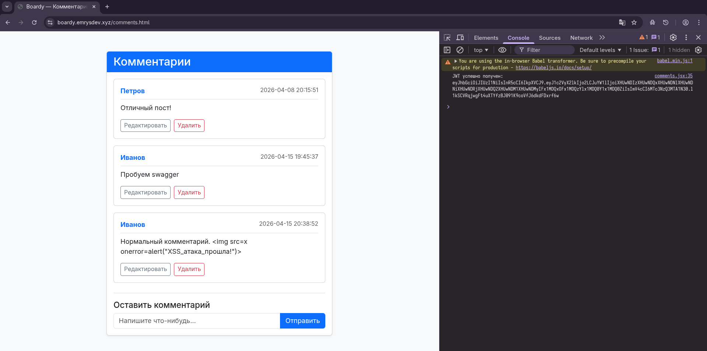

## 4. Использование Bearer в запросах

В React-компоненте добавлен заголовок Authorization: Bearer для fetch-запросов к FastAPI.

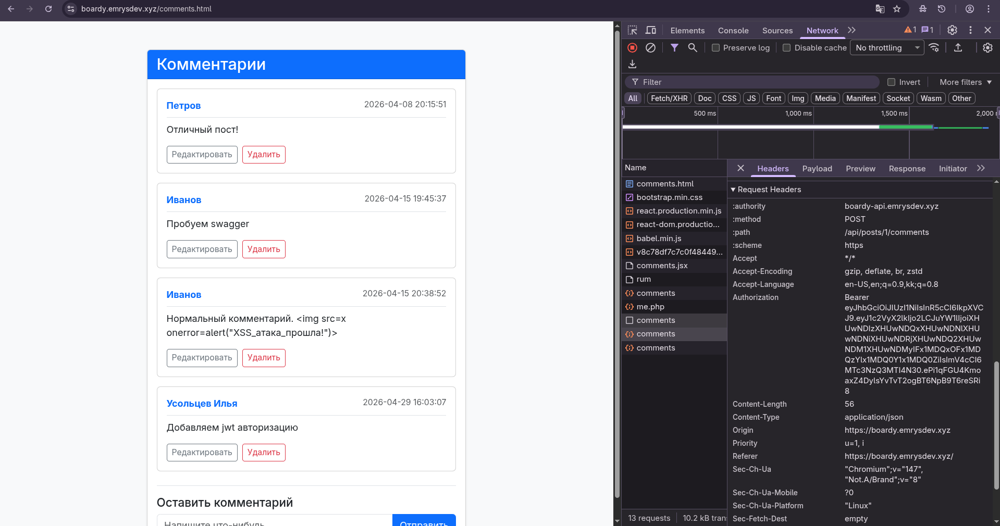

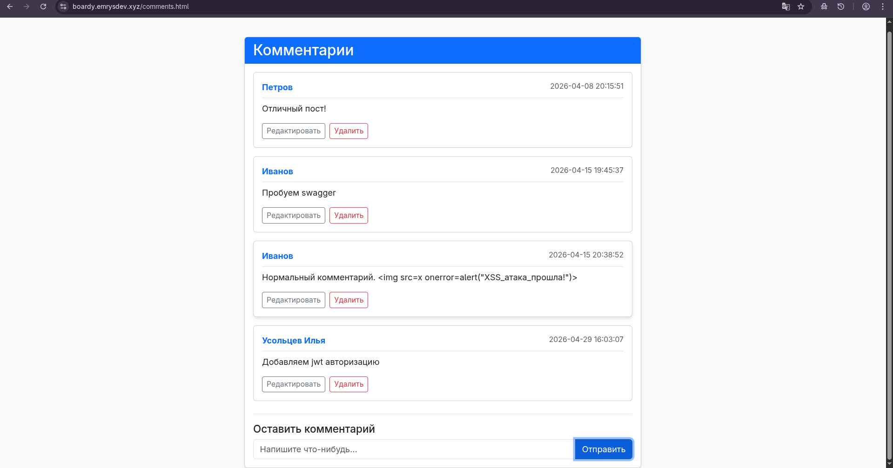

## 5. Декодирование токена (jwt.io)

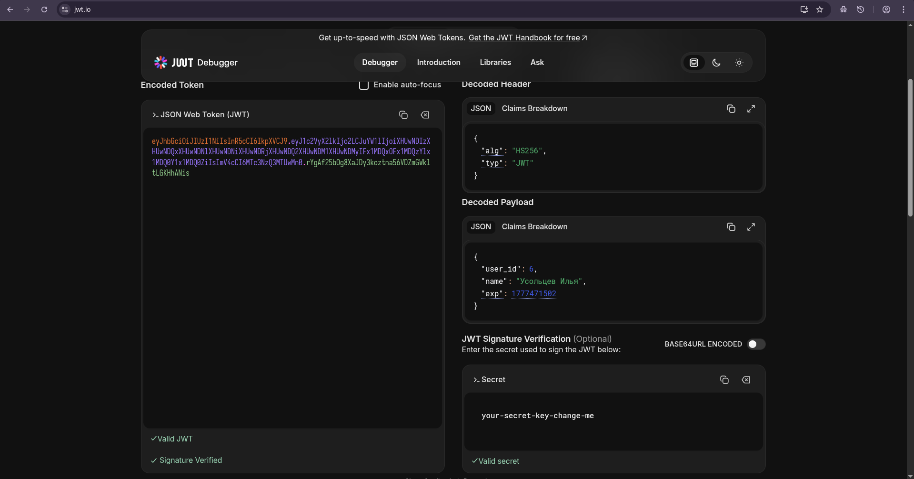

- Payload зашифрован или закодирован?

Он закодирован (в формате Base64Url). Шифрования данных здесь нет.

- Что увидит злоумышленник, перехвативший токен?

Он сможет легко раскодировать его и прочитать всё содержимое payload в открытом виде (ID пользователя, имя, время жизни токена).

- Почему это не проблема?

Безопасность JWT строится не на сокрытии данных, а на целостности. Токен имеет подпись (Signature), сгенерированную с помощью секретного ключа, который хранится только на сервере. Злоумышленник может прочитать данные, но если он попытается их изменить (например, поменять user_id), подпись перестанет совпадать, и сервер отклонит такой токен.

## 6. Истёкший токен

Токен сгенерирован с коротким сроком жизни.

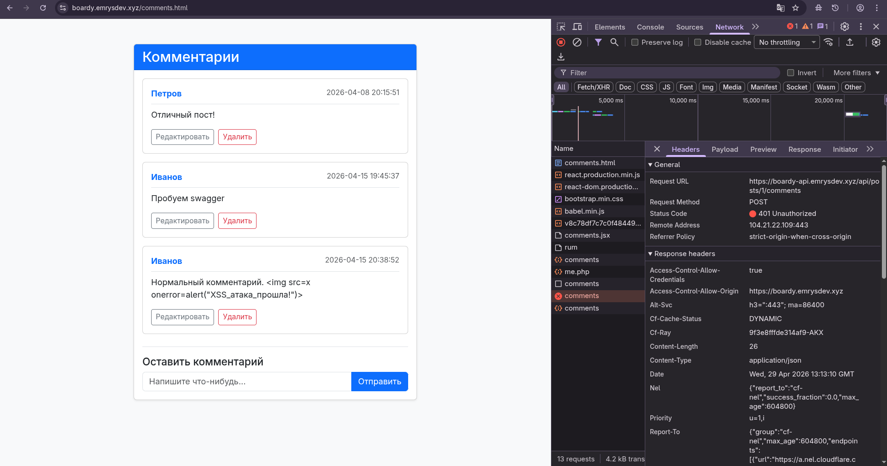

## 7. Невалидный токен

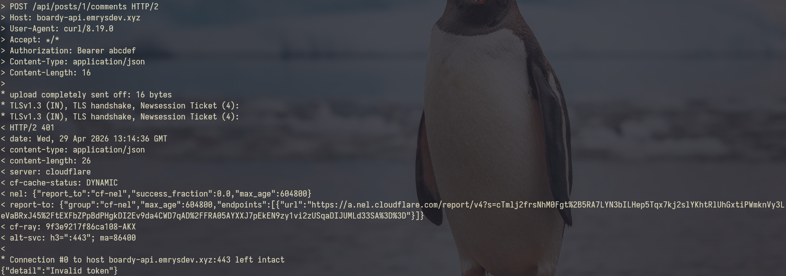

# Часть B. OAuth через GitHub

## 8. Регистрация OAuth App на GitHub

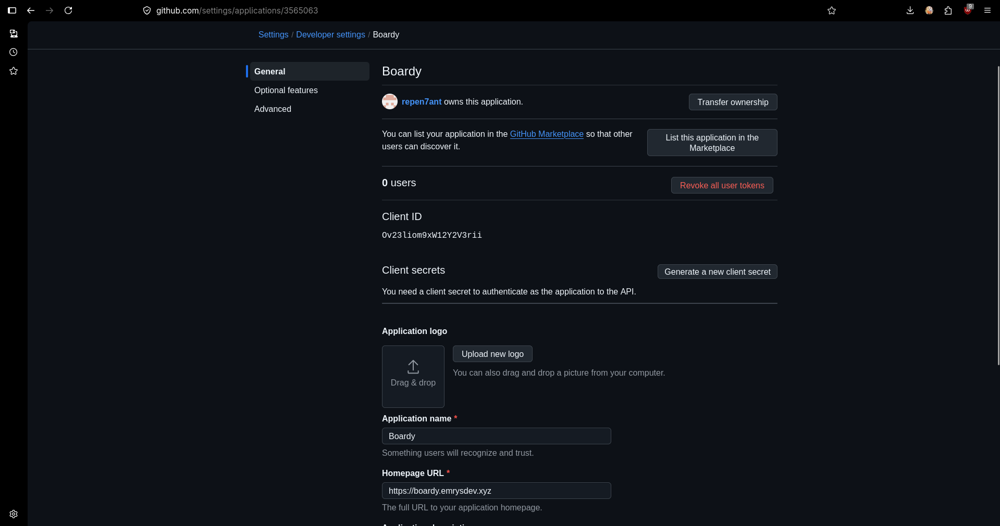

## 9. Обновление базы данных

Добавлен столбец для идентификаторов GitHub.

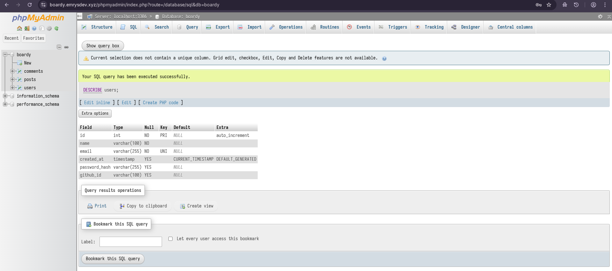

## 10. Кнопка «Войти через GitHub»

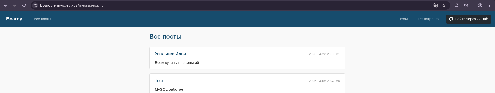

## 11. Процесс OAuth (Flow)

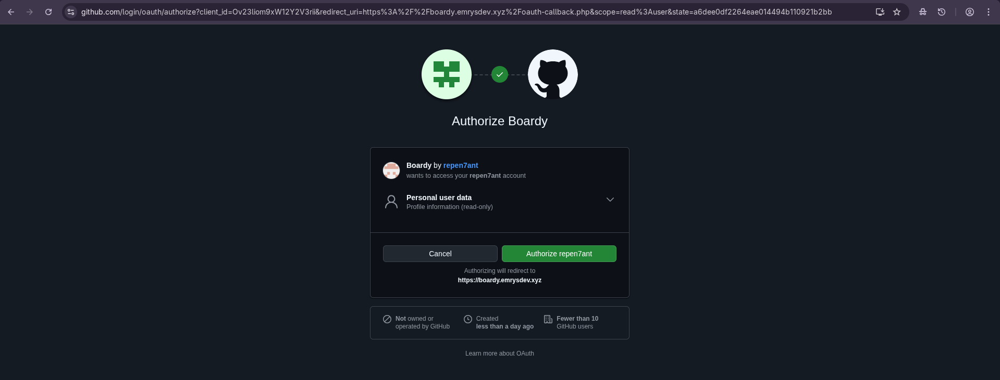

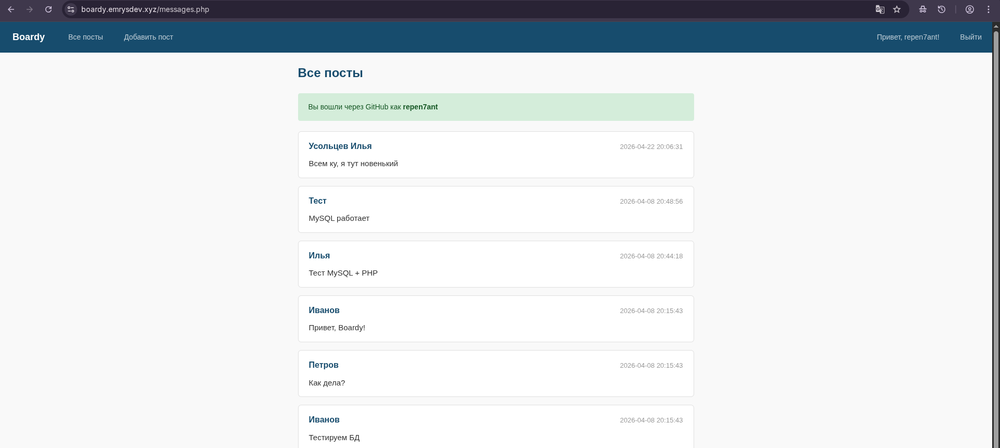

## 12. Проверка БД

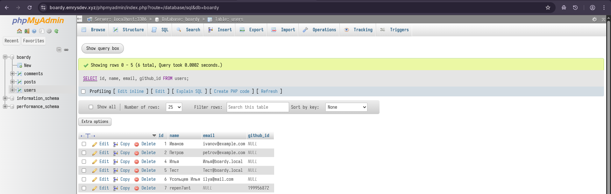

- Почему ищем по github_id, а не по email?

Потому что github_id — это уникальный, неизменный идентификатор, выданный провайдером, который гарантирует точную привязку конкретного GitHub-аккаунта к нашему пользователю.

## 13. Полная цепочка: от OAuth до API

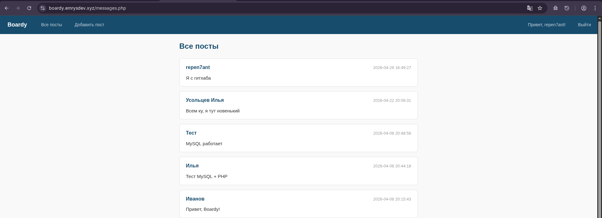

Полный flow работы системы:

1. **Кнопка**: Клиент жмет «Войти через GitHub».
2. **GitHub**: Редирект на GitHub с передачей Client ID и state.
3. **Callback**: GitHub возвращает пользователя на наш сервер (callback URL) с кодом авторизации (code).
4. **Сессия**: Наш сервер обменивает code на Access Token, запрашивает данные профиля у GitHub, находит/создает пользователя в БД и стартует PHP-сессию (PHPSESSID).
5. **me.php**: React-приложение делает запрос с кукой к me.php.
6. **JWT**: me.php проверяет сессию и генерирует JWT.
7. **React**: Клиент сохраняет JWT в память.
8. **FastAPI**: React делает POST-запрос на создание комментария, прикрепляя токен в заголовок Authorization: Bearer.
9. **Комментарий**: FastAPI валидирует JWT, извлекает user_id и сохраняет комментарий в БД.

## 14. Защита с параметром state

- Что такое state в OAuth?

Это случайная, непредсказуемая строка, которую генерирует наше приложение перед началом OAuth-флоу и отправляет провайдеру (GitHub). Провайдер возвращает её обратно на callback неизменной. Наше приложение сравнивает вернувшийся state с тем, что был сохранён в сессии, чтобы убедиться, что запрос инициирован именно этим пользователем.

- Сценарий CSRF-атаки без state:

Злоумышленник авторизуется в нашем приложении через свой GitHub. GitHub перенаправляет злоумышленника на callback URL с валидным code, но злоумышленник прерывает загрузку (не дает приложению завершить вход). Злоумышленник копирует эту ссылку-callback (вида https://boardy.../callback?code=123). Злоумышленник обманом заставляет авторизованную жертву кликнуть по этой ссылке. Браузер жертвы отправляет чужой code на наш сервер. Сервер (без проверки state) привязывает GitHub-аккаунт злоумышленника к текущей сессии жертвы. Итог: злоумышленник получает доступ к аккаунту жертвы, залогинившись через свой GitHub.

# Часть C. Анализ

## 15. Проверка трёх способов входа

## 16. Сравнение механизмов

| Вопрос                     | Куки+сессии                                                | JWT                                                              | OAuth                                                   |
| -------------------------- | ---------------------------------------------------------- | ---------------------------------------------------------------- | ------------------------------------------------------- |
| Где хранятся данные?       | На сервере (в файле или БД), на клиенте — только ID (ключ) | На клиенте (внутри самого токена), на сервере данные не хранятся | На сервере авторизации (GitHub/Google)                  |
| Кто прикрепляет к запросу? | Браузер (автоматически при каждом запросе)                 | Клиентское приложение (вручную в заголовок Authorization)        | Клиент (токен) или Провайдер (при редиректе)            |
| Для какого типа клиентов?  | Классические веб-сайты (рендеринг на сервере)              | Мобильные приложения, SPA, микросервисы                          | Приложения, которым нужен делегированный доступ         |
| Можно ли отозвать?         | Да (достаточно удалить файл на сервере)                    | Нет (пока не истечёт exp, если не использовать черный список)    | Да (отзыв прав через сервер провайдера)                 |
| Кросс-доменно работает?    | Сложно (проблемы с CORS и флагами SameSite)                | Легко (передаётся в заголовке, домены не важны)                  | Да (изначально спроектирован для распределенных систем) |

## 17. Баги и пакеты Laravel

- Баг/Уязвимость: Хранение JWT в localStorage (XSS-уязвимость).

Опасность: Любой вредоносный JavaScript-код на странице (от расширения или XSS-атаки) может прочитать токен и получить полный контроль над API от лица пользователя.

Решение: Пакет Laravel Sanctum. Для SPA-приложений он использует куки первой стороны (First-party cookies) с флагом HttpOnly вместо чистых токенов, защищая от XSS "из коробки".

- Баг/Уязвимость: Отсутствие защиты от CSRF при внешних редиректах (отсутствие или слабая генерация state).

Опасность: Приводит к подмене аккаунтов (как описано в Задании 14). Ручная реализация часто упускает криптографически стойкую генерацию и строгую проверку.

Решение: Пакет Laravel Socialite. Он берет на себя всю работу по генерации, хранению и верификации параметра state под капотом, делая OAuth-flow безопасным по умолчанию.

- Баг/Уязвимость: Невозможность моментально отозвать скомпрометированный JWT.

Опасность: Если токен украден, злоумышленник может использовать его до истечения срока exp. В ручной реализации без состояния (stateless) сервер не может остановить валидный токен.

Решение: Пакет Laravel Passport (или Sanctum в режиме токенов API). Они реализуют гибридную систему (хранят хэши токенов или ID токенов в БД), что позволяет разработчику моментально "отозвать" (revoke) конкретный токен через встроенные методы без написания кастомных блэклистов.
