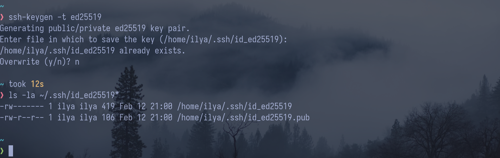
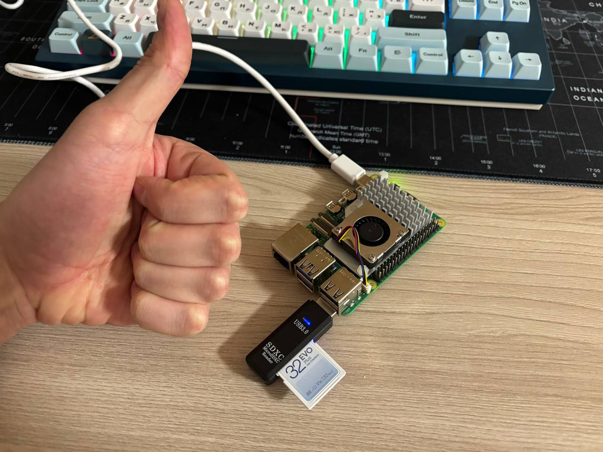
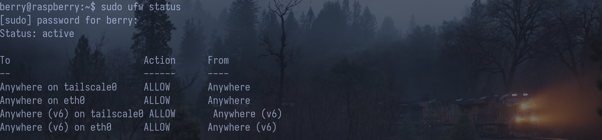
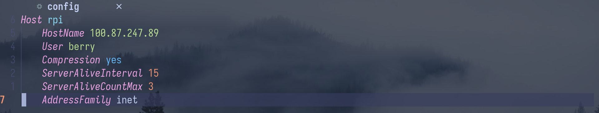
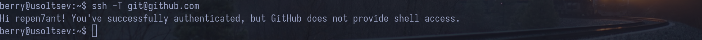
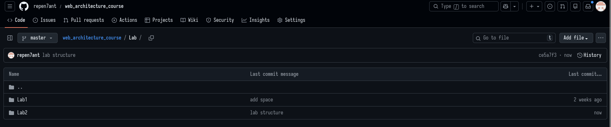

## 1. SSH-ключ

У меня ssh-ключ уже был, поэтому я не стал перезаписывать

## 2. ~~VPS и фаервол~~ Raspberry Pi

Я решил вместо создания VPS в VK Cloud использовать Raspberry Pi 5, на котором поднят tailscale
для подключения по SSH через внутренний IP и хостинга веб-приложений

Так как я в данный момент использую на Raspberry Pi общажный вайфай, я включил фаервол и указал
ему пропускать трафик через tailscale.
Кроме этого, я добавил в фаервол разрешение на подключение по ethernet-кабелю для прямого подлючения к ноутбуку

## 3. Подключение через ~~PuTTY~~ openssh

Для удобного подключения я добавил config-файл в папку .ssh, который позволяет подключаться по команде `ssh rpi`

## 4. Настройка сервера

Изначально после изменения hostname при перезапуске оно сбрасывалось к изначальному, чтобы это решить, нужно было поменять файл /etc/cloud/cloud.cfg,
заменив там в preserve_hostname: false на true

## 5. Пользователь ~~student~~ berry

Пользователь berry, которого я создал при установке ОС, и так не является root-юзером, поэтому
не вижу смысла в создании пользователя student: berry, как по мне, веселее выглядит и связан с названием
микрокомпьютера. Для разнообразия на скрине вывод промпта при подключении через mosh (mobile shell)

## 6. Git и SSH-ключ

_настройка имени и email_

_идентификация_

## 7. Репозиторий и структура

_репозиторий после добавления папки Lab2_

