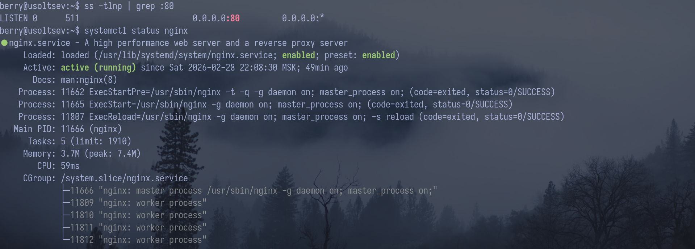
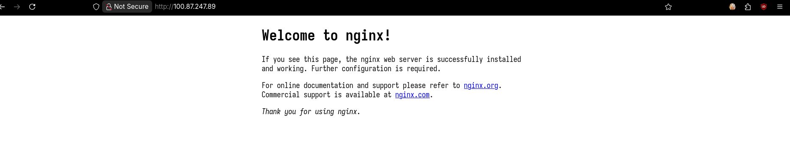
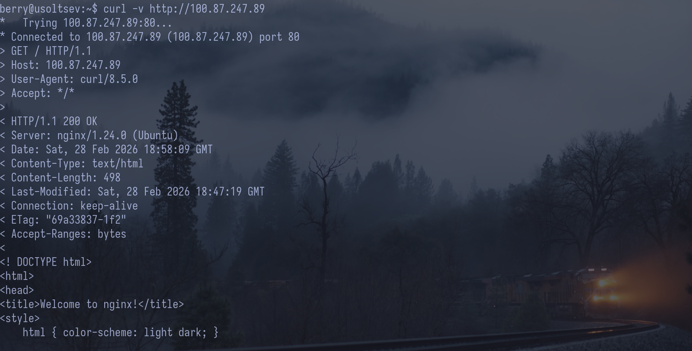
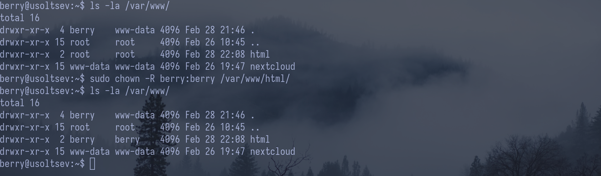
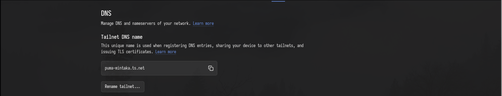
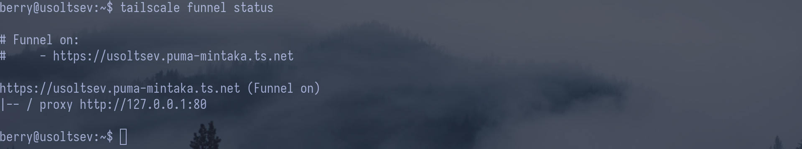
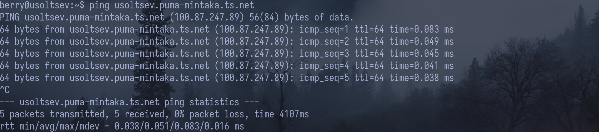
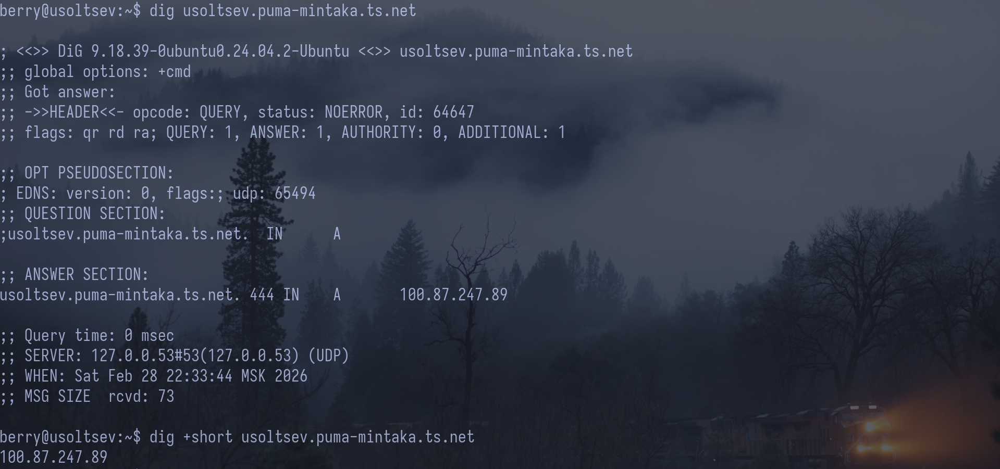
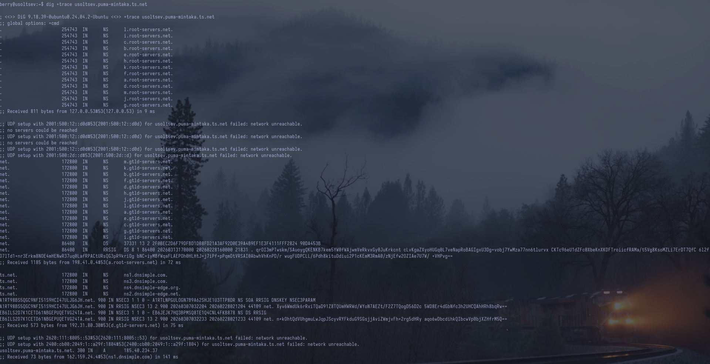
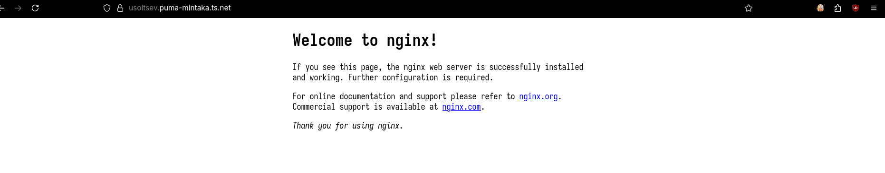

## 1. Установка Nginx

Nginx установлен и работает. Порт 80 свободен

## 2. Страница по IP

Дефолтная страница nginx по IP сервера

## 3. curl

GET / HTTP/1.1 — строка запроса
HTTP/1.1 200 OK — код запроса
Content-Type: text/html — content-type

## 4. Директория и права

Смена владельца директории /var/www/html/ c root на berry

## 5. Конфигурация Nginx

listen 80 default_server; — говорит серверу слушать входящие запросы на стандартном 80-м порту и делать этот сайт основным.

root /var/www/html; — указывает папку на диске, в которой лежат файлы (картинки и текст) вашего сайта.

server*name *; — позволяет серверу отвечать на любые запросы, даже если у сайта нет привязанного доменного имени.

index index.html index.htm index.nginx-debian.html; — содержит список имен файлов, которые сервер должен открыть первыми при заходе на сайт.

## 6. DNS-зона

В качестве DNS-зоны используется автоматически созданный поддомен в сети \*.ts.net.
Управление именами и зоной осуществляется централизованно через панель управления Tailscale без необходимости ручной настройки сторонних DNS-серверов.

## 7. A-запись

Вместо классической A-записи используется технология Tailscale Funnel, которая автоматически сопоставляет публичное доменное имя Raspberry Pi с его внутренним адресом в сети.
Это позволяет обращаться к серверу напрямую через интернет, обходя отсутствие статического IP и настройки роутера.

## 8. ping

DNS работает, домен превратился в IP

## 9. dig

QUESTION SECTION (что спросили): Запрос A-записи (IPv4-адреса) для домена usoltsev.puma-mintaka.ts.net.
ANSWER SECTION (IP + TTL): Возвращен IP-адрес 100.87.247.89 (внутренний адрес в Tailscale); значение 444 — это TTL (время в секундах, на которое этот ответ кэшируется).
SERVER (кто ответил): Ответ пришел от локального DNS-резолвера системы по адресу 127.0.0.53 (стандартный адрес для systemd-resolved в Ubuntu).

## 10. dig + trace

# Шаг 1. Обращение к корневым серверам (.)

Запрос к локальному резолверу для получения списка корневых серверов.
. 254743 IN NS a.root-servers.net.
...
;; Received 811 bytes from 127.0.0.53#53(127.0.0.53)

# Шаг 2. Получение данных о зоне TLD (.net)

Корневой сервер (a.root-servers.net) отправляет нас к серверам, отвечающим за зону .net.
Plaintext

net. 172800 IN NS a.gtld-servers.net.
...
;; Received 1185 bytes from 198.41.0.4#53(a.root-servers.net)

# Шаг 3. Поиск NS-серверов домена (ts.net)

Сервер зоны .net (d.gtld-servers.net) сообщает адреса серверов, которые знают всё про домен ts.net.
Plaintext

ts.net. 172800 IN NS ns1.dnsimple.com.
...
;; Received 573 bytes from 192.31.80.30#53(d.gtld-servers.net)

# Шаг 4. Финальная A-запись (usoltsev.puma-mintaka.ts.net)

Авторитарный сервер ns1.dnsimple.com выдает итоговый публичный IP-адрес сервера.
Plaintext

usoltsev.puma-mintaka.ts.net. 300 IN A 185.40.234.37
;; Received 73 bytes from 162.159.24.4#53(ns1.dnsimple.com)

## 11. Сайт по домену

Страница Nginx в браузере по домену

