# Часть A. Виртуальный хост основного сайта

## 1. Директория проекта

```bash
sudo mkdir -p /var/www/boardy
sudo chown $USER:$USER /var/www/boardy
```

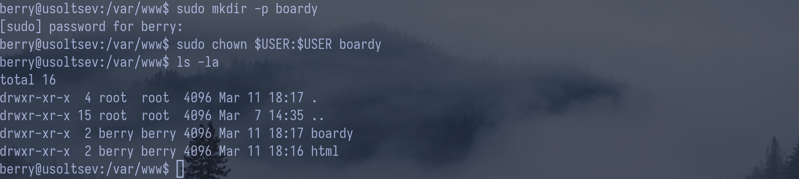

## 2. Конфиг виртуального хоста

```bash
sudo ln -s /etc/nginx/sites-available/boardy /etc/nginx/sites-enabled/
sudo rm /etc/nginx/sites-enabled/default
sudo nginx -t && sudo systemctl reload nginx
```

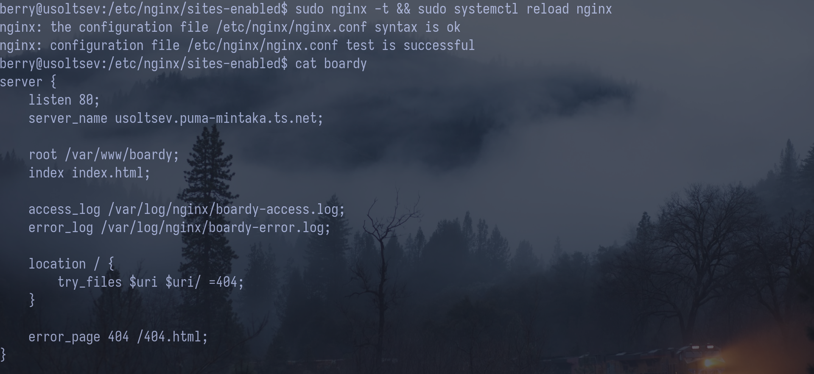

- server_name — доменное имя сервера.
- root — корневая директория сайта.
- access_log — файл логов запросов.
- error_log — файл логов ошибок.
- try_files — проверка существования файлов и возврат первого найденного.
- error_page — кастомная страница для указанной ошибки.

# Часть B. Страницы проекта

## 3. Лендинг

Создана /var/www/boardy/index.html — главная страница Boardy с названием проекта, описанием и ссылкой на форму обратной связи.

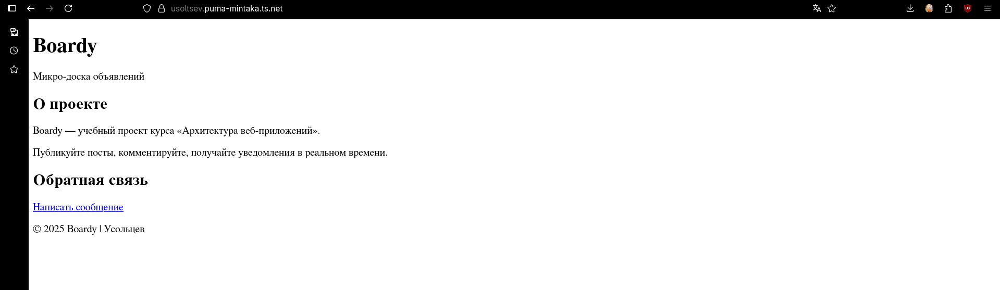

## 4. Форма обратной связи

Создана /var/www/boardy/feedback.html с формой: поля «Имя» и «Сообщение», кнопка «Отправить». Атрибуты формы: method="POST" action="/submit".

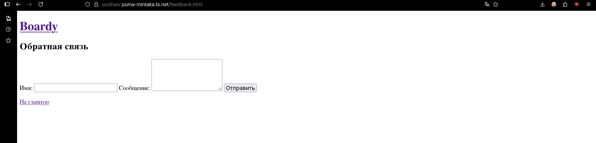

## 5. Стили и 404

Созданы css/style.css и кастомная 404.html.

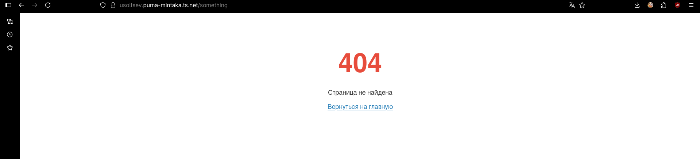

# Часть C. Второй виртуальный хост — API

## 6. DNS-запись для поддомена

В связи с использованием домена Tailscale (\*.ts.net) создание отдельной DNS A-записи для поддомена невозможно, поэтому API реализован на отдельном порту 8080


~## 7. Проверка DNS~

## 8. Конфиг и заглушка API

Создана директория /var/www/boardy-api, заглушка index.html, конфиг /etc/nginx/sites-available/boardy-api

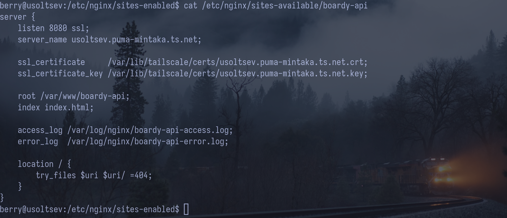

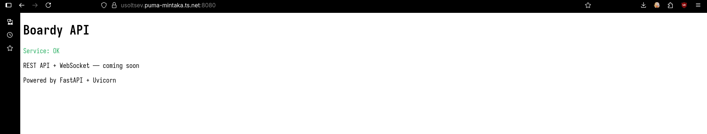

# Часть D. Исследование HTTP

## 9. GET-запрос через curl -v

### Стартовая строка запроса

`GET / HTTP/2`

| Элемент | Значение |
| ------- | -------- |
| Метод   | `GET`    |
| Путь    | `/`      |
| Версия  | `HTTP/2` |

### Заголовок Host

`Host: usoltsev.puma-mintaka.ts.net`

### Стартовая строка ответа

`HTTP/2 200`

| Элемент   | Значение                                               |
| --------- | ------------------------------------------------------ |
| Версия    | `HTTP/2`                                               |
| Код       | `200`                                                  |
| Пояснение | _(не передаётся — в HTTP/2 reason phrase отсутствует)_ |

### Content-Type

`content-type: text/html`

### Content-Length

Отсутствует в ответе. Nginx не передал этот заголовок —
в HTTP/2 размер тела передаётся через механизм фреймов DATA,
явный Content-Length необязателен.


## 10. Виртуальные хосты в действии

### Запрос 1 — основной сайт (порт 80)

```bash
curl -H "Host: usoltsev.puma-mintaka.ts.net" http://100.71.5.3/
```


---

### Запрос 2 — API (порт 8080)

```bash
curl -k -H "Host: usoltsev.puma-mintaka.ts.net" https://100.71.5.3:8080/
```

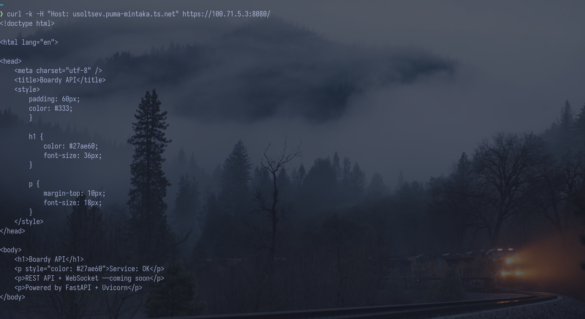

---

### Запрос 3 — неизвестный Host

```bash
curl -H "Host: unknown.ru" http://100.71.5.3/
```

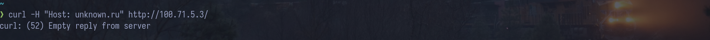

---

### Почему один IP возвращает разные страницы?

Это механизм **виртуальных хостов** (Virtual Hosts) в nginx.
Несмотря на то что оба сайта находятся на одном IP-адресе,
nginx разделяет их по **порту**:

- `listen 80` → директория `/var/www/boardy` → основной сайт
- `listen 8080 ssl` → директория `/var/www/boardy-api` → API-заглушка

Получив запрос, nginx смотрит на порт и заголовок `Host`,
находит подходящий блок `server {}` и отдаёт содержимое
соответствующей директории.

### Что произошло с третьим запросом?

Nginx вернул пустой ответ и закрыл соединение (`Empty reply from server`).
Это поведение настроено явно через блок **default_server**:

```nginx
server {
    listen 80 default_server;
    server_name _;
    return 444;
}
```

`server_name _` — специальный catch-all паттерн, перехватывающий
все запросы, для которых не нашлось подходящего виртуального хоста.
`return 444` — нестандартный код nginx: соединение закрывается
без отправки каких-либо данных.

Без этого блока nginx отдавал бы первый по порядку виртуальный хост
на любой неизвестный `Host`-заголовок.

## 11. POST-запрос

Nginx вернул 405 Method Not Allowed, потому что является статическим веб-сервером и не умеет обрабатывать POST-запросы с данными формы. Маршрут /submit существует в конфиге, но метод POST для него явно не разрешён

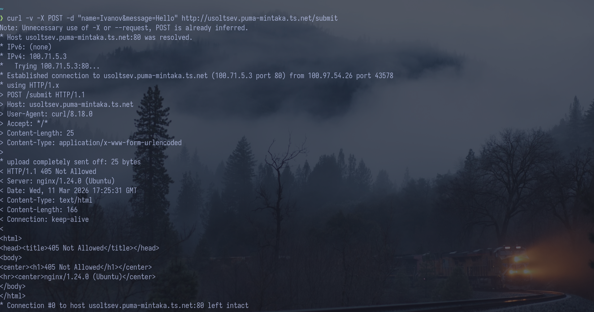

## 12. HEAD-запрос

### Отличие

HEAD возвращает только заголовки, без тела ответа. Заголовки при этом те же самые, что и у GET.

### Зачем нужен HEAD

Чтобы получить метаинформацию о ресурсе — размер, дату изменения, код ответа — не скачивая само содержимое. Удобно для мониторинга и проверки кэша.

# Часть E. Логи

## 13. Раздельные логи

### boardy-access.log

127.0.0.1 - - [11/Mar/2026:20:25:04] "POST /submit HTTP/1.1" 405 ...
│IP: 127.0.0.1 │Метод: POST │Путь: /submit │Код: 405 │UA: Firefox/147.0

127.0.0.1 - - [11/Mar/2026:20:25:04] "GET /index.php/apps/... HTTP/1.1" 404 ...
│IP: 127.0.0.1 │Метод: GET │Путь: /index.php/apps/files/preview-service-worker.js │Код: 404 │UA: Firefox/147.0

100.97.54.26 - - [11/Mar/2026:20:25:31] "POST /submit HTTP/1.1" 405 ...
│IP: 100.97.54.26 │Метод: POST │Путь: /submit │Код: 405 │UA: curl/8.18.0

100.97.54.26 - - [11/Mar/2026:20:28:08] "GET / HTTP/1.1" 200 ...
│IP: 100.97.54.26 │Метод: GET │Путь: / │Код: 200 │UA: curl/8.18.0

100.97.54.26 - - [11/Mar/2026:20:28:14] "HEAD / HTTP/1.1" 200 0 ...
│IP: 100.97.54.26 │Метод: HEAD │Путь: / │Код: 200 │UA: curl/8.18.0

### boardy-api-access.log

100.97.54.26 - - [11/Mar/2026:19:50:26] "GET / HTTP/1.1" 200 ...
│IP: 100.97.54.26 │Метод: GET │Путь: / │Код: 200 │UA: Firefox/147.0

100.97.54.26 - - [11/Mar/2026:19:50:26] "GET /favicon.ico HTTP/1.1" 404 ...
│IP: 100.97.54.26 │Метод: GET │Путь: /favicon.ico │Код: 404 │UA: Firefox/147.0

100.97.54.26 - - [11/Mar/2026:19:50:55] "GET / HTTP/1.1" 304 ...
│IP: 100.97.54.26 │Метод: GET │Путь: / │Код: 304 │UA: Firefox/147.0

100.97.54.26 - - [11/Mar/2026:19:58:30] "GET / HTTP/1.1" 400 ...
│IP: 100.97.54.26 │Метод: GET │Путь: / │Код: 400 │UA: curl/8.18.0

100.97.54.26 - - [11/Mar/2026:19:59:51] "GET / HTTP/1.1" 200 ...
│IP: 100.97.54.26 │Метод: GET │Путь: / │Код: 200 │UA: curl/8.18.0

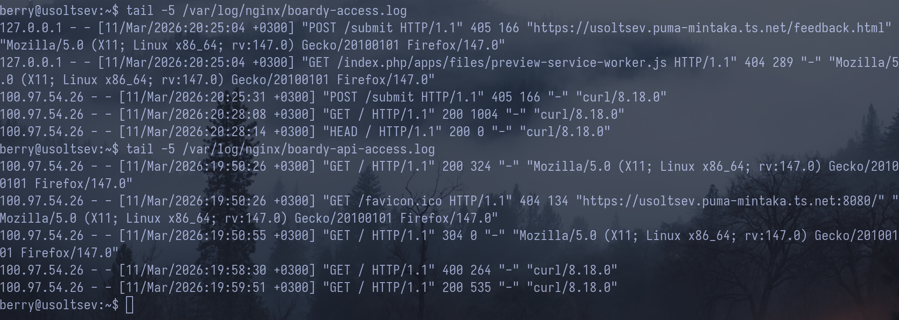

## 14. Фильтрация логов

```bash
# Количество запросов по кодам ответа
awk '{print $9}' /var/log/nginx/boardy-access.log | sort | uniq -c | sort -rn
```

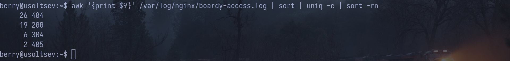
