# Часть A. HTTPS для основного сайта

## 1. ~Установка certbot~

Роль certbot выполняет Tailscale — он сам получает сертификаты от Let's Encrypt через свой ACME-прокси.

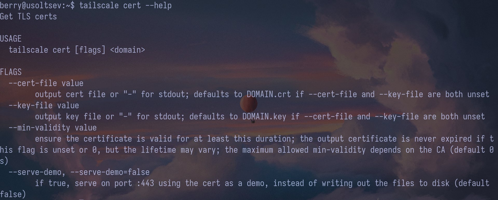

## 2. Получение сертификата

```bash
ls -la /var/lib/tailscale/certs/
```

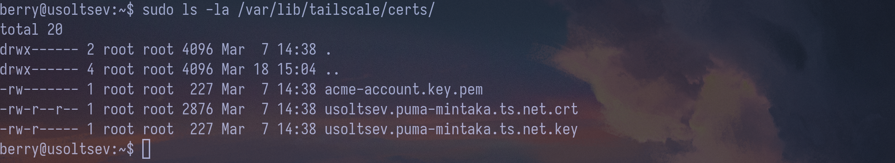

## 3. Проверка в браузере

Замочек был и остался

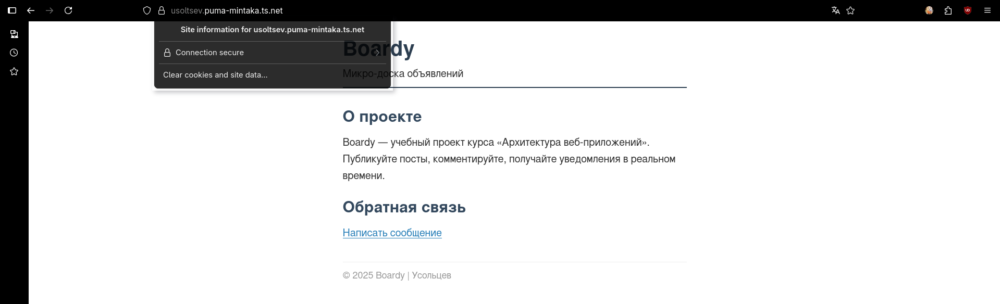

Сертификат выдан центром сертификации Let's Encrypt (промежуточный CA: E7) для домена usoltsev.puma-mintaka.ts.net.
Срок действия: с 07.03.2026 по 05.06.2026 (90 дней).

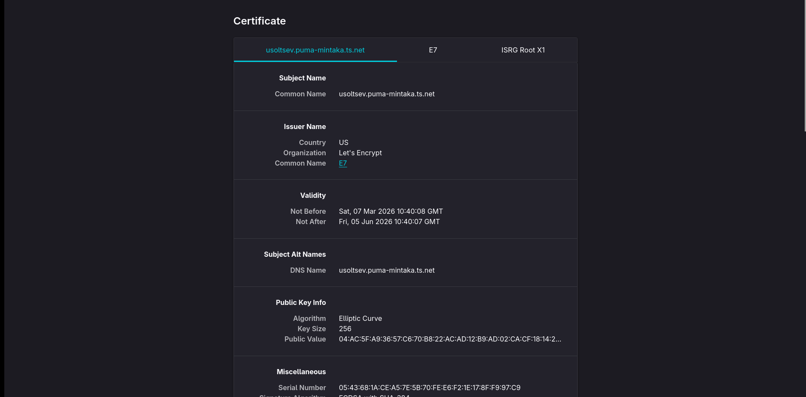

## 4. Редирект

Для вывода 301 пришлось добавить в конфиг файлы костыль:

```bash
# Редирект на HTTPS, если пришли напрямую по HTTP (не через Tailscale Funnel)
if ($http_x_forwarded_proto = "") {
    return 301 https://$host$request_uri;
}
```

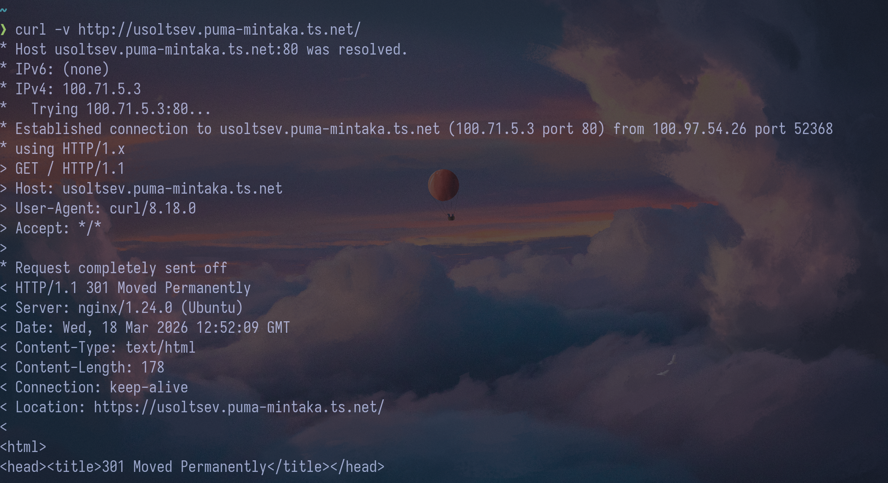

## 5. Конфиг ~после certbot~

TLS-терминация для boardy выполняется на уровне Tailscale Funnel — он принимает входящие HTTPS-соединения на порту 443 и передаёт трафик на nginx уже в открытом виде (HTTP, порт 80). Поэтому в конфиге nginx директивы ssl_certificate и ssl_certificate_key не нужны.
Для boardy-api (порт 8080) Tailscale Funnel не задействован, поэтому TLS-терминация настроена непосредственно в nginx с явным указанием сертификата.
Сертификат в обоих случаях один — выдан Let's Encrypt через механизм tailscale cert.

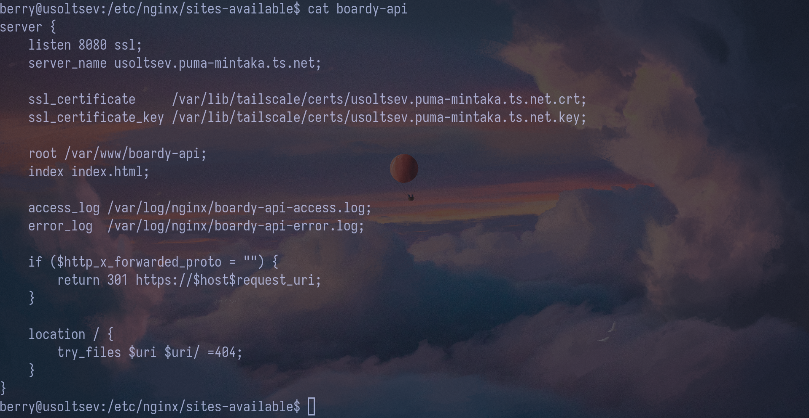

# Часть B. HTTPS для API-сервиса

## 6. ~Сертификат для api-поддомена~

API находится на том же домене, но на другом порту.

## 7. Проверка обоих доменов

```bash
curl -I https://usoltsev.puma-mintaka.ts.net/
curl -I https://usoltsev.puma-mintaka.ts.net:8080/
```

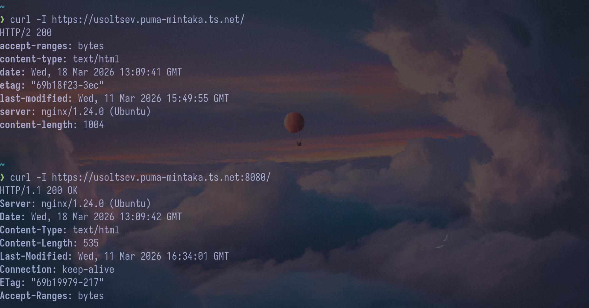

# Часть C. Разбор TLS

## 8. TLS handshake

```bash
curl -v https://usoltsev.puma-mintaka.ts.net/ 2>&1 | grep -E "TLSv|cipher|subject|issuer|expire|SSL certificate"
```

| Поле                | Значение                        |
| ------------------- | ------------------------------- |
| Версия TLS          | TLSv1.3                         |
| Алгоритм шифрования | TLS_AES_128_GCM_SHA256          |
| Обмен ключами       | x25519                          |
| Subject             | CN=usoltsev.puma-mintaka.ts.net |
| Issuer              | Let's Encrypt, CN=E7            |
| Срок действия       | до 05.06.2026                   |

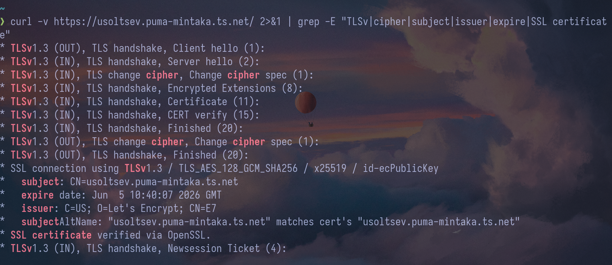

## 9. Цепочка доверия

```bash
echo | openssl s_client -connect usoltsev.puma-mintaka.ts.net:443 -showcerts 2>/dev/null | grep -E 's:|i:'
```

### Цепочка доверия

ISRG Root X1 (корневой CA)
└── Let's Encrypt E7 (промежуточный CA)
└── usoltsev.puma-mintaka.ts.net (сертификат сайта)

### Как браузер проверяет цепочку

1. Сервер присылает свой сертификат и промежуточный (E7)
2. Браузер проверяет подпись сертификата сайта — она должна быть подписана E7
3. Подпись E7 проверяется через ISRG Root X1
4. ISRG Root X1 находится в доверенном хранилище браузера — цепочка замкнута
5. Если подписи верны и сертификат не истёк — соединение считается доверенным

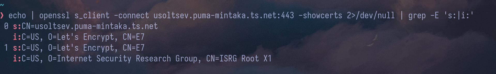

## 10. Сравнение сертификатов

```bash
echo | openssl s_client -connect usoltsev.puma-mintaka.ts.net:443 2>/dev/null | openssl x509 -noout -subject -dates
echo | openssl s_client -connect usoltsev.puma-mintaka.ts.net:8080 2>/dev/null | openssl x509 -noout -subject -dates
```

**Общее:** оба сервиса используют один и тот же сертификат, выданный Let's Encrypt.

**Отличие:** TLS-терминация происходит в разных местах —
для :443 в Tailscale Funnel, для :8080 непосредственно в nginx.

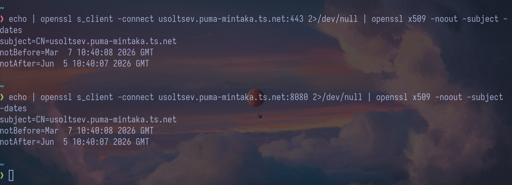

# Часть D. HSTS, кэширование, gzip

## 11. HSTS

HSTS (HTTP Strict Transport Security) — заголовок, который сообщает браузеру, что данный сайт доступен только по HTTPS. После первого получения заголовка браузер автоматически преобразует все последующие HTTP-запросы к этому домену в HTTPS, не обращаясь к серверу. Это защищает от атак типа SSL stripping, при которых злоумышленник пытается понизить соединение с HTTPS до HTTP.

```bash
#В конфиг boardy добавлено:
add_header Strict-Transport-Security "max-age=31536000" always;

curl -I http://127.0.0.1/ -H "Host: usoltsev.puma-mintaka.ts.net" -H "X-Forwarded-Proto: https" | grep -i strict
```

Заголовок Strict-Transport-Security выставляется nginx. При проверке через Tailscale Funnel заголовок не виден, так как Funnel выступает reverse proxy и не пробрасывает все заголовки ответа. При прямом обращении к nginx заголовок присутствует.

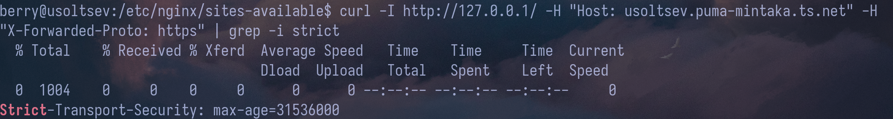

## 12. Кэширование и gzip

```bash
#В конфиг boardy добавлено:
location ~* \.(css|js|png|jpg|jpeg|gif|ico|svg)$ {
    expires 7d;
    add_header Cache-Control "public, no-transform";
}
gzip on;
gzip_types text/plain text/css application/json application/javascript text/xml;
gzip_min_length 256;

curl -I http://127.0.0.1/css/style.css -H "Host: usoltsev.puma-mintaka.ts.net" -H "X-Forwarded-Proto: https" | grep -E 'Cache|Expires'
curl -H "Accept-Encoding: gzip" -I http://127.0.0.1/ -H "Host: usoltsev.puma-mintaka.ts.net" -H "X-Forwarded-Proto: https" | grep Content-Encoding
```

Аналогично прошлому заданию Tailscale срезает заголовки, поэтому показываю запросы напрямую.

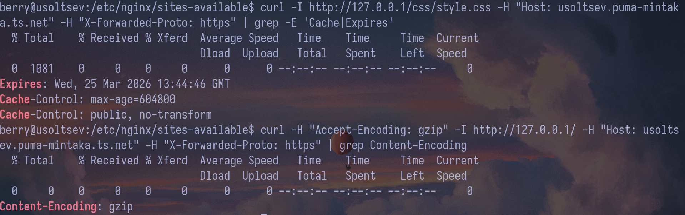

## 13. Автообновление

Сертификат управляется Tailscale, который автоматически обновляет его до истечения срока.
Ручного запуска certbot renew не требуется — аналог выполняется демоном tailscaled.
