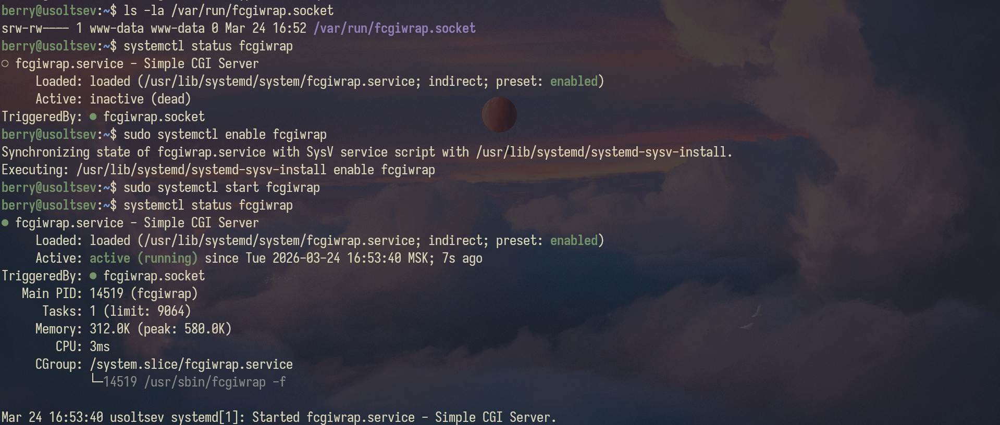
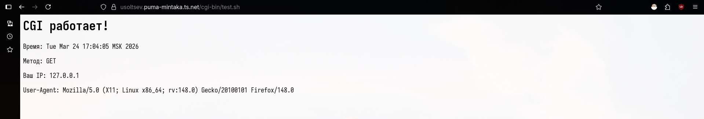
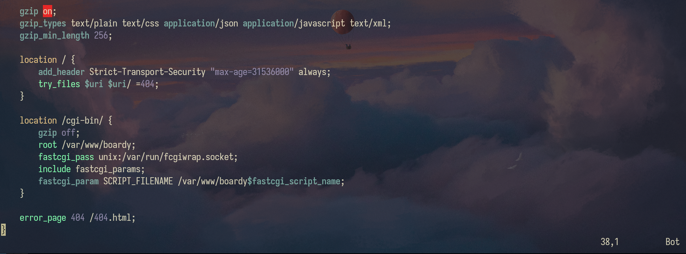
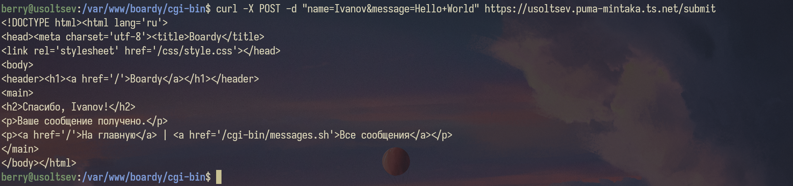
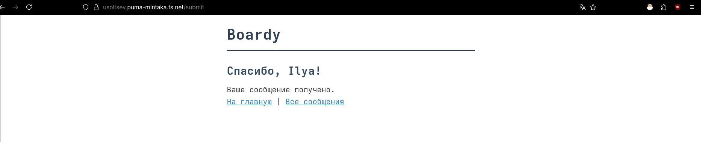
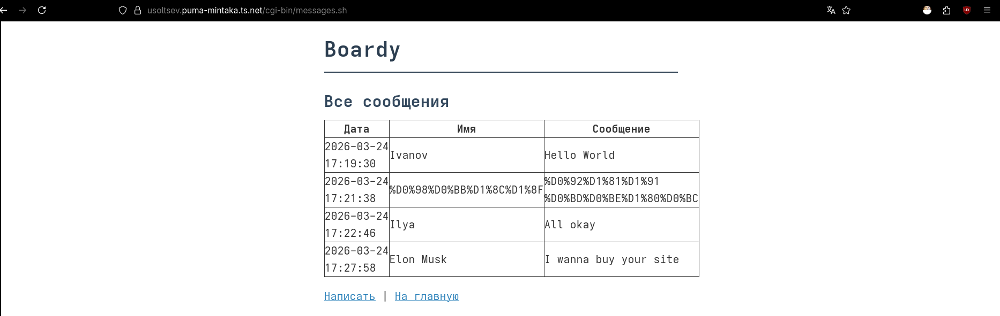
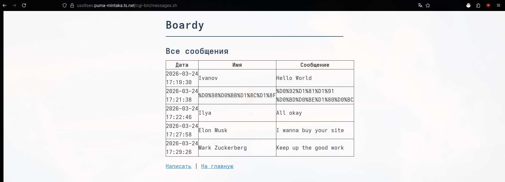

# Часть A. CGI-скрипт

## 1. Установка fcgiwrap

```bash
sudo apt install -y fcgiwrap
ls -la /var/run/fcgiwrap.socket
```



## 2. Тестовый скрипт

Создан скрипт /var/www/boardy/cgi-bin/test.sh, выводящий время, метод, IP, User-Agent.



## 3. Конфигурация Nginx

location /cgi-bin/ добавлена в конфиг boardy.



```bash
fastcgi_pass unix:/var/run/fcgiwrap.socket
```

Говорит Nginx не просто отдавать файл как текст, а перенаправить его «посреднику» (fcgiwrap) через специальный канал (сокет). Именно fcgiwrap запустит скрипт.

```bash
include fastcgi_params;
```

Загружает стандартный список «шпаргалок» для сервера. Это технические данные, которые помогают скрипту понять, какой у пользователя IP, какой метод запроса (GET или POST) и т.д.

```bash
fastcgi_param SCRIPT_FILENAME /var/www/boardy$fastcgi_script_name;
```

Передает fcgiwrap точный путь к файлу на диске, чтобы тот знал, какую именно программу нужно запустить.

# Часть B. Форма Boardy

## 4. Скрипт обработки формы

Создан submit.sh, который читает POST из stdin, извлекает name и message, сохраняет в messages.txt, возвращает «Спасибо, {имя}!».



## 5. Форма в браузере

Страница «Спасибо, {ваше имя}!» в браузере



## 6. Данные на диске

```bash
cat /var/www/boardy/data/messages.txt
```


# Часть C. Страница сообщений

## 7. Скрипт вывода сообщений

Создан messages.sh, который читает messages.txt, генерирует HTML-таблицу.



## 8. Полный цикл

Отправлено новое сообщение через форму → новое сообщение в списке.



# Часть D. Анализ

## 9. Путь запроса

1. **Браузер (Клиент)**
   * **Действие:** Пользователь вводит «Илья» и «Привет» в поля формы и жмет кнопку.
   * **Событие:** Браузер формирует тело запроса: `name=Ilya&message=Hello`.
   * **Транспорт:** Данные упаковываются в **HTTPS** пакет (шифруются), чтобы никто по пути не перехватил сообщение.

2. **Сеть → Nginx**
   * **Прием:** Nginx слушает порт **443** (HTTPS). Он расшифровывает пакет.
   * **Маршрутизация:** Nginx видит `POST /submit`. Он сверяет это с конфигом (`location = /submit`).
   * **Решение:** «Ага, этот запрос я не могу обработать сам, мне нужно передать его в `fcgiwrap`».

3. **Nginx → FastCGI → fcgiwrap (Посредник)**
   * **Передача:** Nginx перекидывает данные через Unix-сокет (`/var/run/fcgiwrap.socket`) по протоколу FastCGI.
   * **Работа fcgiwrap:** Этот сервис «оживляет» скрипт. Он берет тело POST-запроса и превращает его в поток данных для **stdin** (стандартный ввод) скрипта.

4. **submit.sh (Логика на сервере)**
   * **stdin (Вход):** Скрипт через команду `read` заглатывает данные, пришедшие от `fcgiwrap`.
   * **messages.txt (Запись):** Команда `echo "$NAME: $MSG" >> messages.txt` дописывает новую строку в конец файла.
   * **stdout (Выход):** Скрипт выдает через `echo` HTML-код: `<h1>Спасибо!</h1>`. Все, что скрипт печатает в консоль, перехватывается `fcgiwrap`.

5. **Путь назад: fcgiwrap → Nginx → Браузер**
   * **Сборка:** `fcgiwrap` забирает результат работы скрипта и отдает его обратно Nginx.
   * **Шифрование:** Nginx добавляет HTTP-заголовки, снова упаковывает всё в **TLS (HTTPS)**.
   * **Финал:** Браузер получает ответ и рисует пользователю страницу с благодарностью.

---

## 10. Теоретические вопросы

1. **Что такое CGI и какую проблему он решил?**
   CGI (*Common Gateway Interface*) — это первый стандартный протокол для взаимодействия веб-сервера со сторонними программами. Он решил проблему «статичного интернета», позволив серверам не просто отдавать готовые файлы, а генерировать страницы на лету (например, выдавать результаты поиска из базы данных).

2. **Как CGI-скрипт получает данные POST-запроса?**
   Скрипт считывает тело запроса через **стандартный поток ввода (stdin)**, как если бы пользователь вводил текст с клавиатуры. При этом метаданные (длина запроса, IP-адрес) передаются скрипту через переменные окружения операционной системы.

3. **Почему CGI создаёт проблемы при высокой нагрузке?**
   На каждый новый запрос сервер вынужден запускать отдельный процесс в системе (например, заново загружать интерпретатор Bash или Python), что быстро съедает всю оперативную память и ресурсы процессора. Это делает невозможным обслуживание тысяч пользователей одновременно без зависания сервера.

4. **Чем отличается fastcgi_pass от proxy_pass?**
   `fastcgi_pass` используется для общения по специфическому бинарному протоколу FastCGI, который понимает только специализированное ПО (вроде PHP-FPM или `fcgiwrap`). `proxy_pass` — это универсальный способ переслать обычный HTTP-запрос на другой полноценный веб-сервер или приложение (например, Python Gunicorn или Node.js).

5. **Зачем нужен fcgiwrap, если Apache запускает CGI напрямую?**
   Nginx спроектирован как максимально быстрый и легкий сервер, поэтому в него намеренно не встроили функции запуска сторонних программ. `fcgiwrap` выступает посредником, который принимает инструкции от Nginx и берет на себя работу по запуску скриптов в системе.
