# Интро

Я перешел с бесплатного домена от tailscale на свой собственный домен. Сайт хостится через cloudflare tunnel. Работает только через vpn, к сожалению.

# Часть A. PHP-FPM

## 1. Установка PHP-FPM

```bash
sudo apt install -y php-fpm php-mysql php-mbstring php-xml
```

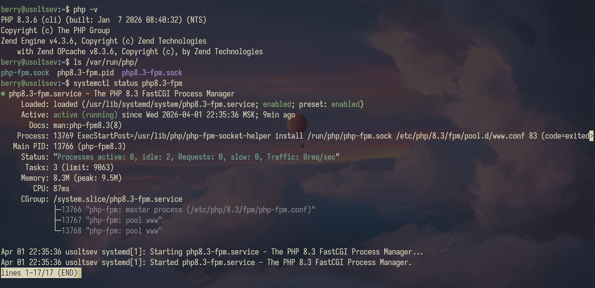

## 2. Форма и сообщения на PHP

Созданы submit.php и messages.php. Обновлены action формы.


## 3. Конфиг Nginx для PHP

Добавлен location ~ \.php$ с fastcgi_pass. Старые location с CGI закомментированы.

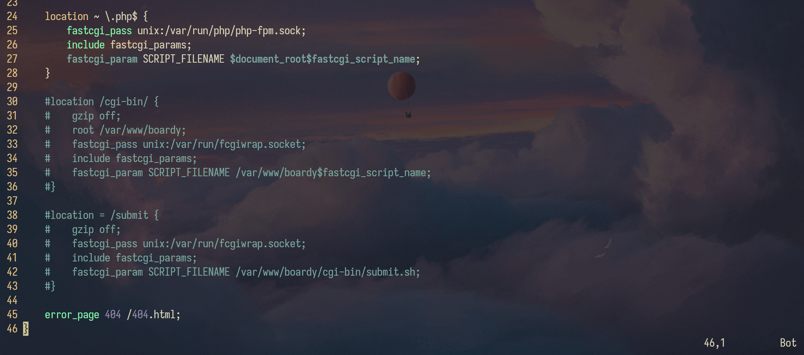

CGI создаёт новый процесс на каждый запрос и убивает его после. FPM держит пул готовых воркеров — запрос просто попадает к уже запущенному процессу.

## 4. Shared nothing

Создан demo-shared-nothing.php (счётчик) и вызван 3 раза.
Каждый запрос — новый процесс с нуля, переменные между запросами не сохраняются.


## 5. Блокировка воркеров

Создан demo-slow.php (sleep(2)). Запущено 10 параллельных запросов.

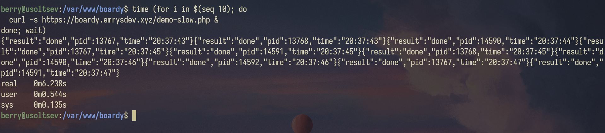

6 секунд, 5 воркеров, 10 запросов — значит два запроса на воркер, две волны по 2 секунды = 4 секунды, но с накладными расходами вышло 6

# Часть B. FastAPI

## 6. Установка и приложение

Создан main.py с /api/status, /api/messages, /api/slow, /api/slow-blocking, /api/counter.

```bash
curl http://127.0.0.1:8000/api/status
```


```bash
curl http://127.0.0.1:8000/api/messages
```

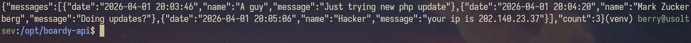

## 7. Живой процесс (счётчик)


FastAPI — это долгоживущий процесс с общей памятью между запросами, а PHP-FPM каждый раз выполняет скрипт заново с чистым состоянием.
Поэтому здесь счётчик растёт, а в PHP - нет.

## 8. Async: 10 запросов за 2 секунды

```bash
# 1 запрос — 2 секунды
time curl http://127.0.0.1:8000/api/slow

# 10 параллельных — тоже ~2 секунды!
time (for i in $(seq 10); do
  curl -s http://127.0.0.1:8000/api/slow &
done; wait)
```

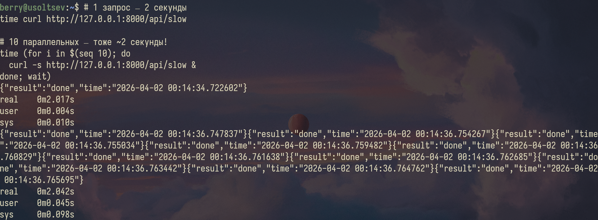

asyncio.sleep не блокирует поток — event loop просто переключается на другие запросы пока ждёт, и все 10 спят одновременно.

## 9. Блокирующий код убивает event loop

```bash
# То же самое, но /api/slow-blocking (time.sleep вместо asyncio.sleep)
time (for i in $(seq 5); do
  curl -s http://127.0.0.1:8000/api/slow-blocking &
done; wait)
# ~10 секунд! time.sleep заблокировал event loop.
# await asyncio.sleep — отпускает. time.sleep — держит
```

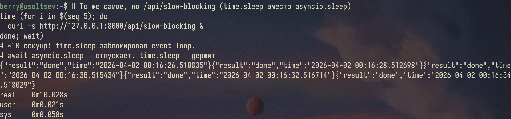

asyncio.sleep отпускает event loop и все запросы ждут параллельно, а time.sleep блокирует поток и запросы выполняются строго по одному.

## 10. Swagger

https://boardy-api.emrysdev.xyz/docs# в браузере.

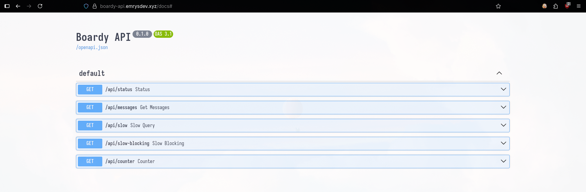

## 11. systemd-сервис

Создан /etc/systemd/system/boardy-api.service.

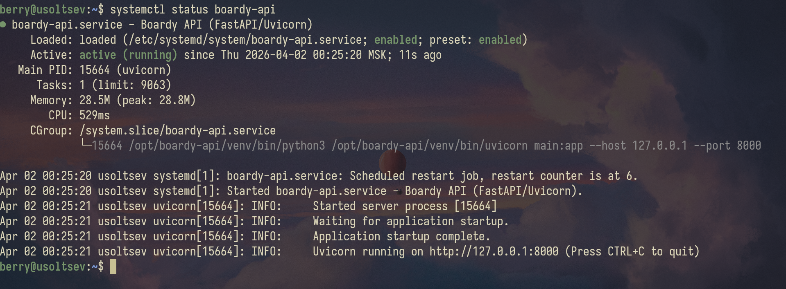

## 12. Nginx proxy_pass

Заглушка заменена на proxy_pass в конфиге boardy-api.

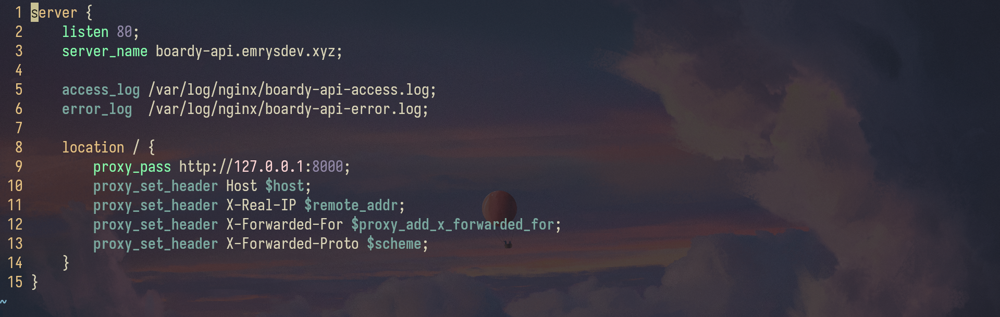

fastcgi_pass говорит по протоколу FastCGI (который понимает PHP-FPM), а proxy_pass — по обычному HTTP (который понимает FastAPI/uvicorn).

# Часть C. Сравнение

## 13. Два формата

```bash
curl https://boardy.emrysdev.xyz/messages.php
curl https://boardy-api.emrysdev.xyz/api/messages
```

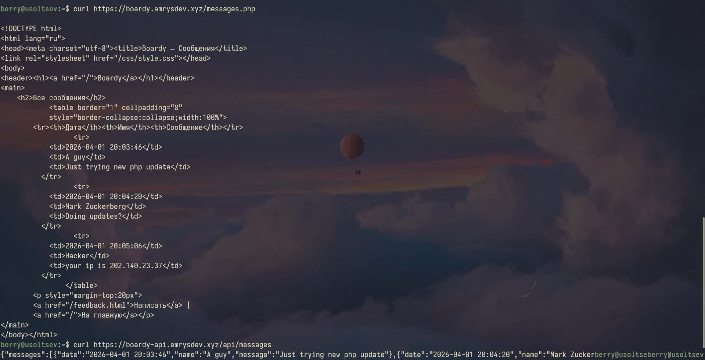

PHP отдаёт HTML для браузера, FastAPI отдаёт JSON для других программ и фронтенда.

## 14. Процессы

```bash
ps aux | grep php-fpm | head -5
ps aux | grep uvicorn
```

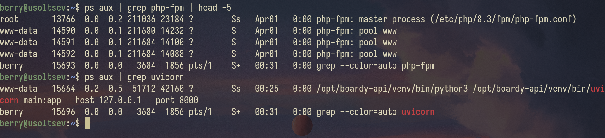
