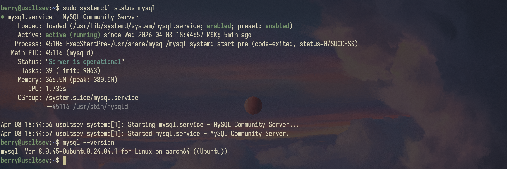
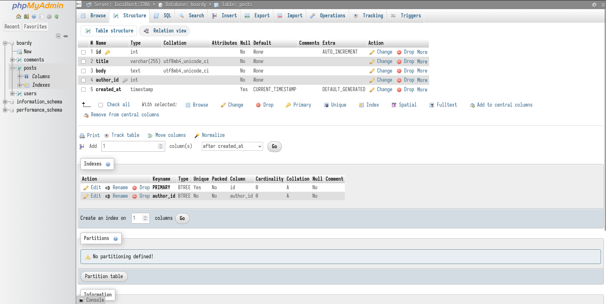
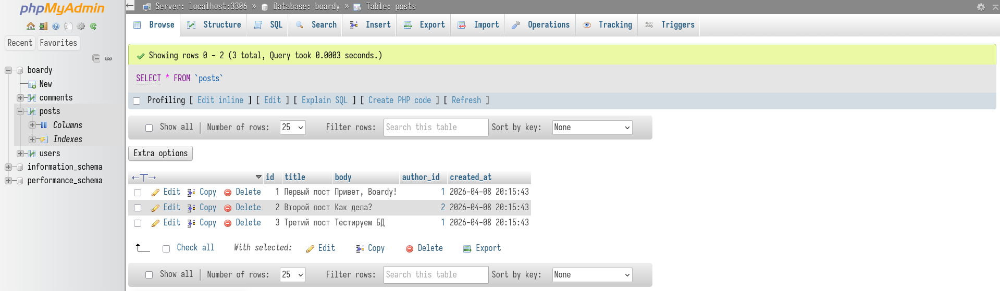
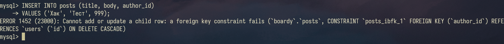
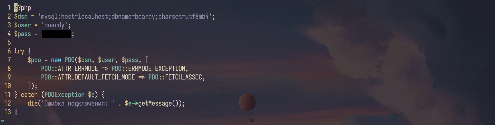
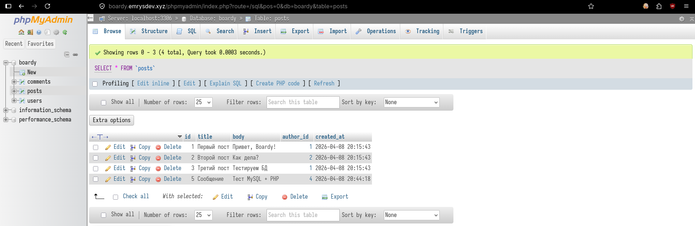
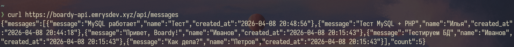
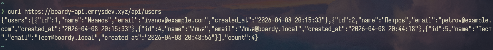

# Часть A. MySQL — установка и настройка

## 1. Установка MySQL

```bash
sudo apt install -y mysql-server
sudo mysql_secure_installation
```



## 2. База данных и пользователь

Создана бд boardy (utf8mb4, utf8mb4_unicode_ci), пользователь boardy.


### Почему utf8mb4, а не utf8?

utf8mb4 — чтобы хранить любые символы, включая эмодзи.

### Что такое collation и зачем unicode_ci?

collation - это правила сравнения и сортировки символов.
unicode_ci — чтобы искать и сортировать без головной боли с регистром

## 3. phpMyAdmin

Установлен phpMyAdmin, подключен к Nginx, выполнен вход под пользователем boardy.


# Часть B. Таблицы и связи

## 4. Три таблицы

Созданы users, posts, comments с FOREIGN KEY и ON DELETE CASCADE.




### Что такое FOREIGN KEY и ON DELETE CASCADE? Зачем? Какой движок используется и почему?

FOREIGN KEY — гарантирует что связанные данные существуют. CASCADE — автоматически чистит "осиротевшие" записи. InnoDB — единственный движок который всё это умеет.

## 5. SQL-скрипт

Все CREATE TABLE сохранены в файл src/boardy/sql/schema.sql. DROP TABLE IF EXISTS добавлен в начало (чтобы скрипт работал повторно).


# Часть C. SQL — базовые операции

## 6. INSERT

Добавлены 3 пользователя, 5 постов (от разных авторов), 3 комментария.




## 7. SELECT + JOIN

```bash
SELECT posts.title, posts.body, users.name AS author
FROM posts
JOIN users ON posts.author_id = users.id;
```


### Зачем JOIN? Как получить имя автора без него?

author_id хранит только цифру 1, а не имя — JOIN нужен чтобы "подтянуть" имя из таблицы users по этой цифре.

## 8. Foreign Key — защита целостности

```bash
INSERT INTO posts (title, body, author_id)
VALUES ('Хак', 'Тест', 999);
```



## 9. CASCADE

Удалил пользователя -> его посты и комменты удалились.


(постов от этого пользователя не было, коммент был 1)

## 10. SQL-инъекция

```bash
SELECT \* FROM users WHERE name = '' OR '1'='1';
```


### Как работает SQL-инъекция? Как prepared statement защищает?

Инъекция — когда данные от пользователя становятся частью SQL-кода.
Prepared statement — передаёт данные отдельно, поэтому они никогда не могут стать кодом.

# Часть D. PHP + MySQL

## 11. db.php

Создан db.php с PDO-подключением (charset=utf8mb4).



## 12. submit.php через MySQL

submit.php переписан: INSERT через prepared statement.




## 13. messages.php через MySQL

messages.php переписан: SELECT JOIN вместо file().


# Часть E. FastAPI + MySQL

## 14. aiomysql

Установлен aiomysql. Обновлен main.py: /api/messages и /api/users читают из MySQL.

```bash
curl https://boardy-api.emrysdev.xyz/api/messages
```



```bash
curl https://boardy-api.emrysdev.xyz/api/users
```



### Почему aiomysql, а не обычный mysql-connector? Что будет с event loop при синхронном драйвере?

Синхронный драйвер останавливает весь сервер на время запроса к БД — с aiomysql сервер продолжает работать пока MySQL думает.
