# Часть A. REST API

## 1. Структура проекта#

Созданы database.py и routers/comments.py

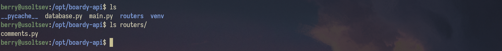

## 2. GET — список комментариев

```bash
curl https://boardy-api.emrysdev.xyz/api/posts/1/comments
```

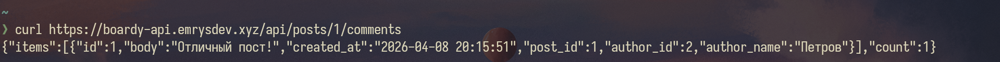

## 3. POST — создать комментарий

```bash
curl -i -X POST https://boardy-api.emrysdev.xyz/api/posts/1/comments -H "Content-Type: application/json" -d "{\"body\": \"Мой комментарий\"}"
```

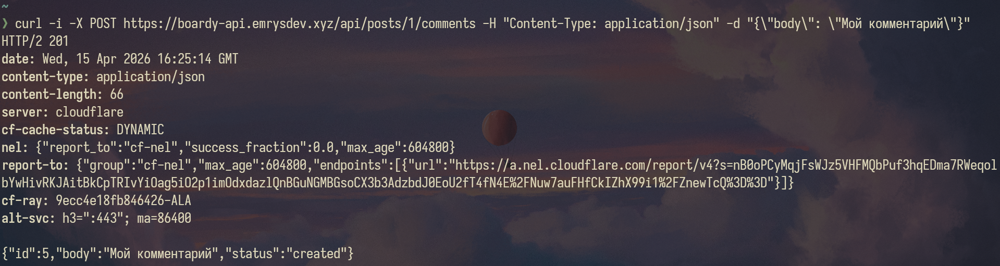

### Почему 201, а не 200?

200 OK означает просто успех. 201 Created означает, что что-то было успешно создано.

### Что означает Content-Type: application/json?

Content-Type — сообщает получателю, как именно нужно интерпретировать поток байтов, который идёт следом. application/json — указывает, что данные отформатированы как JSON.

## 4. PUT — редактировать

```bash
curl -i -X PUT https://boardy-api.emrysdev.xyz/api/comments/5 -H "Content-Type: application/json" -d '{"body": "Исправлено"}'
```

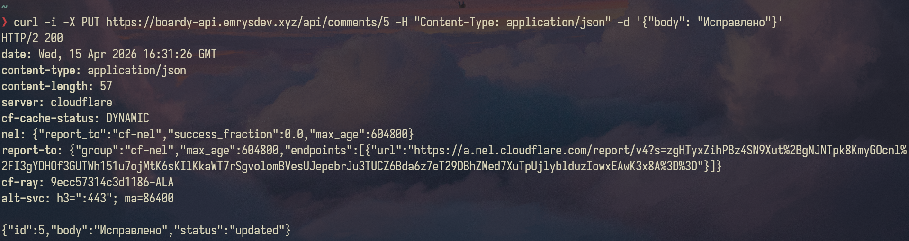

### Чем PUT отличается от POST?

PUT изменяет часть ресурса, POST создает новый ресурс.

### Почему URL другой (/comments/{id}, а не /posts/{id}/comments)?

Потому что мы изменяем по id коммента, а не поста.

## 5. DELETE — удалить

```bash
curl -X DELETE https://boardy-api.emrysdev.xyz/api/comments/5
```

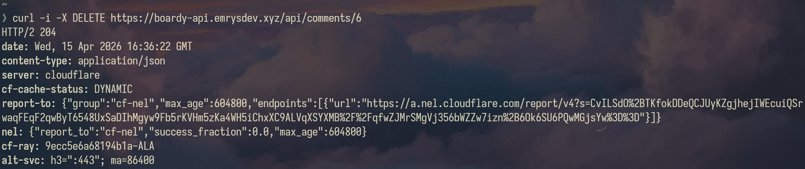

### 4 HTTP-глагола и их коды

| Глагол | Код ответа     | Почему именно этот код?                                                                   |
| ------ | -------------- | ----------------------------------------------------------------------------------------- |
| GET    | 200 OK         | Запрос выполнен успешно, данные переданы в теле ответа. Ресурс просто прочитан.           |
| POST   | 201 Created    | Ресурс успешно создан (в логе видим id: 5). Это подтверждает появление новой записи в БД. |
| PUT    | 200 OK         | Ресурс успешно обновлен. В отличие от POST, новый объект не создается, а меняется старый. |
| DELETE | 204 No Content | Ресурс удален. Код 204 означает «Успешно, но отвечать нечем» (тело ответа пустое).        |

## 6. Ошибки

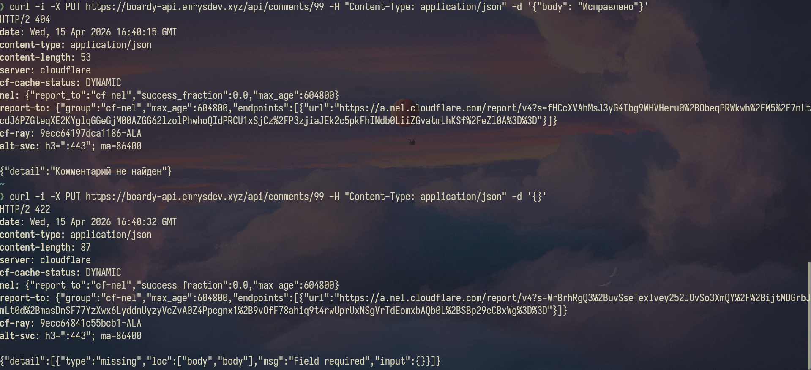

### Чем 404 отличается от 422?

404 - не найдено, 422 - необрабатываемый экземпляр

## 7. Swagger

```bash
https://boardy-api.emrysdev.xyz/docs#
```

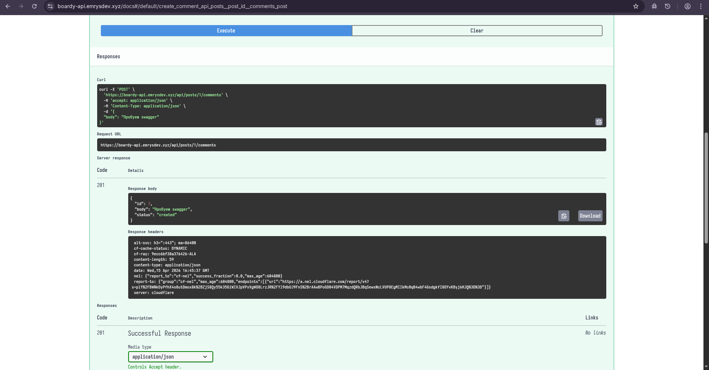

# Часть B. JavaScript-клиенты

## 8. Vanilla JS — демо

Список комментариев + создание нового на Vanilla JS


### Что делает функция esc()? Что случится если её не вызвать?

Функция esc() выполняет экранирование (escape) HTML-символов. Она превращает опасные спецсимволы вроде < и > в их безопасные текстовые аналоги (&lt; и &gt;).
Если не вызвать, сайт станет уязвимым для XSS-атаки (Cross-Site Scripting).

## 9. React — полный CRUD

Комментарии на React

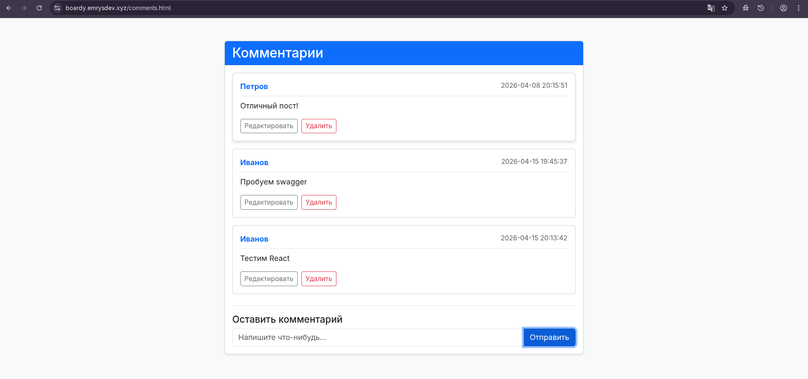

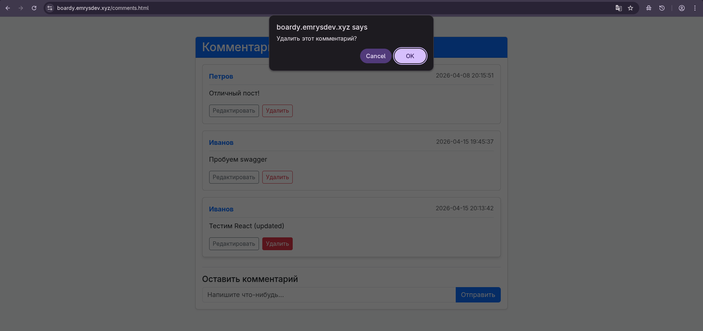

## 10. Сравнение кода

| Пункт                   | Vanilla JS (Чистый JS)                                                                                                      | React (Библиотека)                                                                                                                      |
| ----------------------- | --------------------------------------------------------------------------------------------------------------------------- | --------------------------------------------------------------------------------------------------------------------------------------- |
| Где хранится состояние? | В самом DOM. Чтобы узнать, что ввел пользователь, мы «лезем» в документ: `document.getElementById('body').value`.           | В State (`useState`). Данные живут в переменных JavaScript отдельно от разметки. Поле ввода просто «зеркалит» состояние.                |
| Обновление списка       | Вручную. Нужно либо полностью очистить контейнер и заново вставить HTML через `innerHTML`, либо точечно добавлять узлы.     | Автоматически. Просто обновляем массив данных `setItems(newArray)`. React сам видит изменения и перерисовывает нужные части.            |
| Редактирование          | Манипуляции с узлами. Нужно найти текст, удалить его, создать `input`, кнопки «ОК» и «Отмена» и навесить на них события.    | Условный рендер. В коде пишется простое условие: `{editId === id ? <Input /> : <Text />}`. Достаточно сменить ID в памяти.              |
| Защита от XSS           | Наша забота. При использовании `innerHTML` браузер выполнит любой скрипт из комментария. Нужно писать функции типа `esc()`. | Встроено по умолчанию. React автоматически экранирует всё, что выводится в фигурных скобках `{item.body}`. Вставить вирус не получится. |

## 11. DevTools → Network

comments.html → DevTools → Network → перезагрузка.

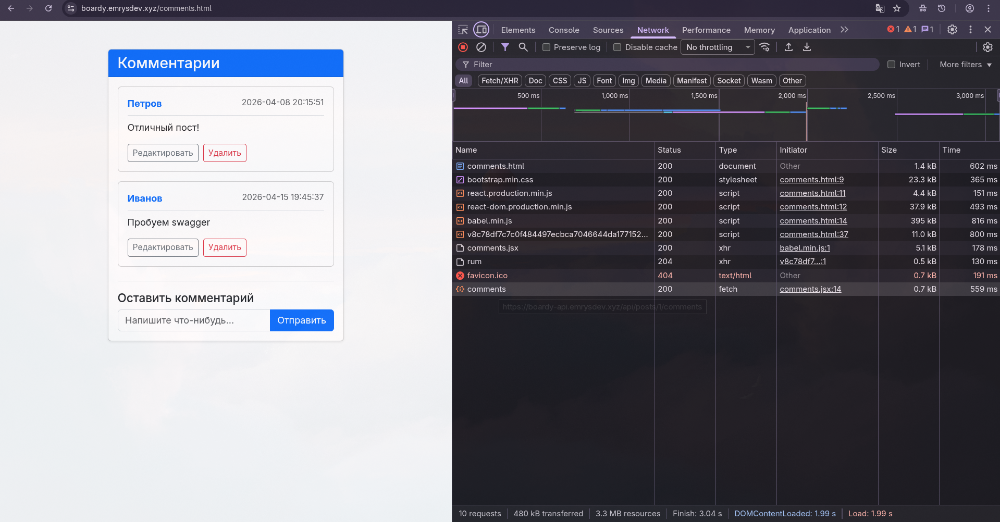

# Часть C. SSR vs CSR

## 12. View Source

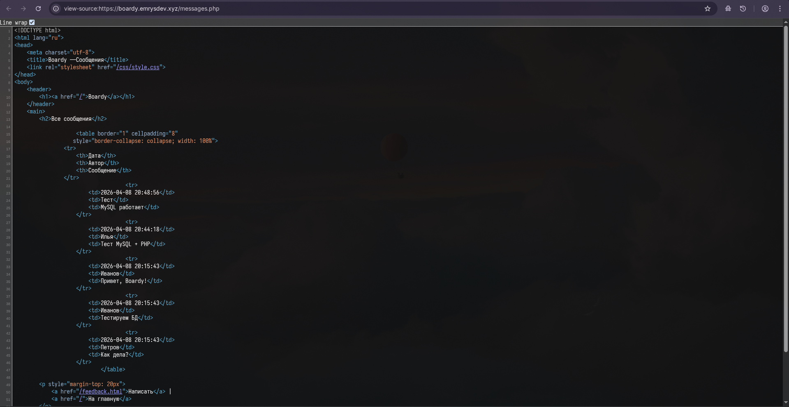
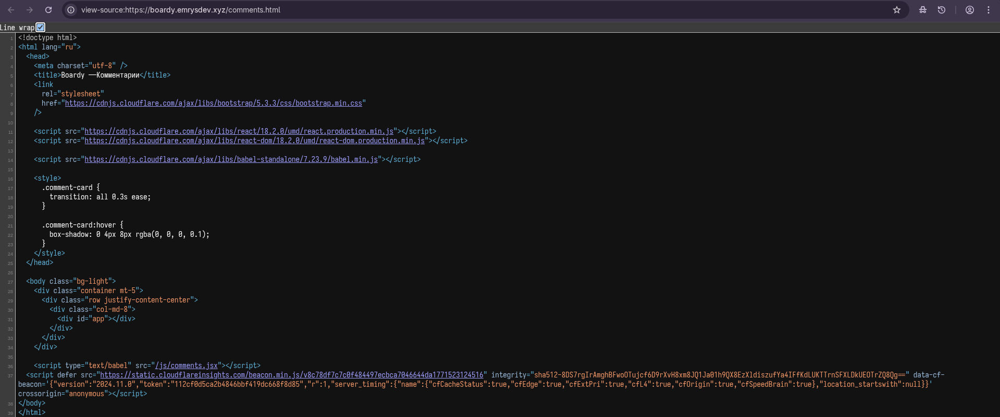

При CSR сервер отдаёт только пустой HTML и JavaScript. View Source показывает этот пустой шаблон, потому что контент рендерится позже в браузере. Поисковые боты могут не дождаться загрузки контента, поэтому для SEO важных проектов лучше использовать SSR.

## 13. XSS

```bash
curl -i -X POST https://boardy-api.emrysdev.xyz/api/posts/1/comments \
     -H "Content-Type: application/json" \
     -d '{"body": "Нормальный комментарий. "}'
```


### Как vanilla JS и React защищаются от XSS? Какой способ надёжнее?

React автоматически экранирует данные в фигурных скобках, превращая опасные теги в безопасный текст, а Vanilla JS требует ручной защиты через textContent или функцию-экранатор. React надёжнее, так как безопасность включена по умолчанию, а уязвимость возможна только через явное dangerouslySetInnerHTML. В Vanilla JS достаточно один раз забыть очистить данные — и сайт становится уязвимым для XSS-атак.

## 14. Итоговая таблица

| Критерий                   | SSR (PHP)                                            | Vanilla JS                                               | React                                                          |
| -------------------------- | ---------------------------------------------------- | -------------------------------------------------------- | -------------------------------------------------------------- |
| Кто рендерит HTML?         | **Сервер** — PHP генерирует готовый HTML до отправки | **Браузер** — JS вручную создаёт DOM через createElement | **Браузер** — React рендерит виртуальный DOM                   |
| Формат ответа сервера      | Готовый **HTML**                                     | Пустой HTML + **JSON** от API                            | Пустой HTML + **JSON** от API                                  |
| View Source: данные видны? | **Да** — весь контент в исходнике                    | **Нет** — данные подгружаются после, исходник пустой     | **Нет** — в исходнике только `<div id="root">`                 |
| Перезагрузка при отправке? | **Да** — форма POST возвращает новую страницу        | **Нет** — fetch/XHR отправляет данные без перезагрузки   | **Нет** — запросы через fetch, состояние обновляется реактивно |
| Защита от XSS              | **Вручную** — нужен `htmlspecialchars()` и аналоги   | **Слабая** — `innerHTML` опасен без явного экранирования | **Встроенная** — JSX автоматически экранирует значения         |
| Сложность кода             | **Низкая** — запрос → шаблон → ответ                 | **Средняя** — DOM, события и fetch вручную               | **Высокая** — компоненты, хуки, state, props, сборка           |
